# Rule_Keeper · 분할매수 기록장

라오어 무한매수법(V2.2, V4.0)과 VR 5.0을 여러 전략으로 동시에 운용할 때 쓰는 개인 비서입니다.
매일 저녁 전략마다 주문표를 계산하고, 다음 날 체결을 기록하며, AI에게 현재 상태와 규칙의 근거를 물어볼 수 있습니다.
감정이 아니라 규칙대로 매매하도록 돕는 것이 목표입니다.

> 투자 권유가 아닌 규칙 계산 보조 도구입니다. 무한매수법·VR 방법론의 원저작자는 라오어입니다.

| 구분 | 주소 |
| --- | --- |
| 웹 화면 (Vercel) | https://rulekeeper-frontend.vercel.app |
| 백엔드 API (Render) | https://rule-keeper.onrender.com |
| Swagger UI | https://rule-keeper.onrender.com/docs |
| MCP 서버 (보너스 1 외부 채널) | 저장소의 [`mcp_server/`](mcp_server/) — 내 PC에서 실행해 위 백엔드 API를 호출 |

Render 무료 요금제라 15분 동안 접속이 없으면 서버가 잠듭니다. 첫 접속은 30~60초 걸릴 수 있으며, 화면에 "서버를 깨우는 중" 안내가 나옵니다.

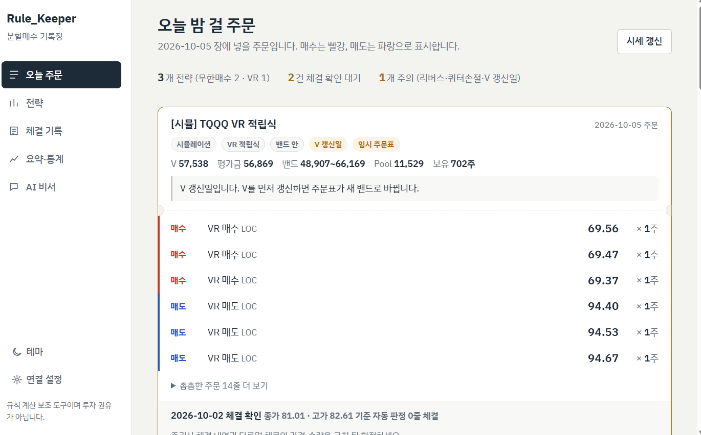

### 목차

1. [무엇을 해결하나요](#1-무엇을-해결하나요)
2. [기술 스택](#2-기술-스택)
3. [화면과 기능](#3-화면과-기능)
4. [과제 대응표](#4-과제-대응표) — 과제 목표 6가지, 최종 결과물 4가지, 기능 요구사항 1~10, 보너스
5. [제출 스크린샷](#5-제출-스크린샷)
6. [AI 호출 흐름 (Function Calling)](#6-ai-호출-흐름)
7. [MCP 서버 연동 (멀티채널)](#7-mcp-서버-연동-멀티채널)
8. [구조](#8-구조)
9. [주요 API](#9-주요-api)
10. [실행과 배포](#10-실행과-배포)
11. [설계 설명](#11-설계-설명) — 과제 목표 6가지를 그림과 함께 자세히
12. [기술 선택과 장단점](#12-기술-선택과-장단점)
13. [개발 중 겪은 문제와 해결](#13-개발-중-겪은-문제와-해결)
14. [한계와 개선 방향](#14-한계와-개선-방향)

---

## 1. 무엇을 해결하나요

일반 ChatGPT는 내 전략 상태를 모릅니다. "오늘 뭐 걸어야 해?"라고 물어도 일반론만 돌아옵니다.
무한매수법·VR을 여러 전략으로 동시에 돌리면 전략마다 T, 평단, 별지점, V가 달라서 매일 저녁 손으로 계산하기 번거롭고 실수하기 쉽습니다.

Rule_Keeper는
- 매일의 시세(시계열 데이터)와 내 체결 기록을 Firestore에 저장하고,
- 규칙대로 상태와 다음 주문표를 서버가 계산하며,
- 그 요약을 GPT의 시스템 프롬프트에 넣어 **"내 상황을 아는 AI 비서"**로 답하게 합니다.

### 하루 사용 흐름

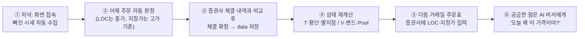
```mermaid
flowchart LR
    A["① 저녁: 화면 접속<br/>빠진 시세 자동 수집"] --> B["② 어제 주문 자동 판정<br/>(LOC는 종가, 지정가는 고가 기준)"]
    B --> C["③ 증권사 체결 내역과 비교 후<br/>체결 확정 → data 저장"]
    C --> D["④ 상태 재계산<br/>T·평단·별지점 / V·밴드·Pool"]
    D --> E["⑤ 다음 거래일 주문표<br/>증권사에 LOC·지정가 입력"]
    E --> F["⑥ 궁금한 점은 AI 비서에게<br/>'오늘 왜 이 가격이야?'"]
```

| 일반 ChatGPT에 물으면 | Rule_Keeper AI 비서에 물으면 |
| --- | --- |
| "무한매수법은 일반적으로 평단 아래에서 매수하고…" 같은 일반론 | "이 전략은 지금 T 3.23, 별지점 82.02입니다", "VR 전략은 V 58,941, 밴드 50,100~67,782입니다"처럼 **내 데이터의 숫자**를 인용 (예시는 시뮬레이션 전략의 실제 값) |
| 내 체결 기록·전략 설정을 모름 | Firestore에 저장된 체결 기록과 설정을 서버가 계산해 전달 |
| 숫자를 지어낼 수 있음 | 숫자는 서버 계산값만 인용하도록 지시하고, 없으면 도구로 조회 |

## 2. 기술 스택

| 영역 | 사용 기술 |
| --- | --- |
| 백엔드 | Python 3.11, FastAPI, Uvicorn, Pydantic, python-dotenv |
| 데이터베이스 | Firebase Firestore (firebase-admin) |
| AI | OpenAI API 호환 엔드포인트 (`gpt-5-mini`, Function Calling) |
| 시세 수집 | yfinance |
| 프론트엔드 | 바닐라 HTML / CSS / JavaScript (프레임워크·빌드 도구 없음, 그래프는 SVG 직접 작성) |
| 외부 채널 | MCP 서버 (Python `mcp` 패키지의 FastMCP, stdio 방식) |
| 배포 | Render (백엔드), Vercel (프론트엔드), GitHub |
| 테스트 | unittest (엔진 30개 + 서비스 19개) |

과제가 지정한 필수 패키지(`fastapi`, `uvicorn`, `firebase-admin`, `openai`, `python-dotenv`)는 모두 `backend/requirements.txt`에 있습니다. 여기에 요청 검증용 `pydantic`(FastAPI에 포함), 시세 수집용 `yfinance`, 미국 시간대 계산용 `tzdata`를 더했습니다.

## 3. 화면과 기능

| 화면 | 내용 |
| --- | --- |
| **오늘 주문** | 전략별 다음 거래일 주문을 전표 형태로 보여 줍니다(매수 빨강, 매도 파랑). 전날 주문은 그날 종가·고가로 자동 판정하고, 확인 후 **체결 확정**으로 기록합니다. |
| **전략** | 무한매수법·VR 전략을 종목·계좌별로 여러 개 등록합니다(실전/시뮬레이션). 상세 화면에서 상태, 그래프, 사이클·V 갱신 이력, VR V 갱신을 다룹니다. |
| **체결 기록** | 체결 기록(data) 조회·추가·수정·삭제, 필터, CSV/JSON 내려받기 |
| **요약·통계** | 종목별 시세 그래프와 통계(기간, 개수, 평균, 최대, 최소, 추세, 변동성, 최대 낙폭), AI에게 들어가는 요약 원문 |
| **AI 비서** | 대화 기록 · 채팅 · AI가 보는 요약 3단 구성. 전략을 골라 질문하면 그 전략 기준으로 답하고, 사용한 도구를 답 아래에 표시합니다. |

| 전략 상세 | 요약·통계 |
| --- | --- |
| 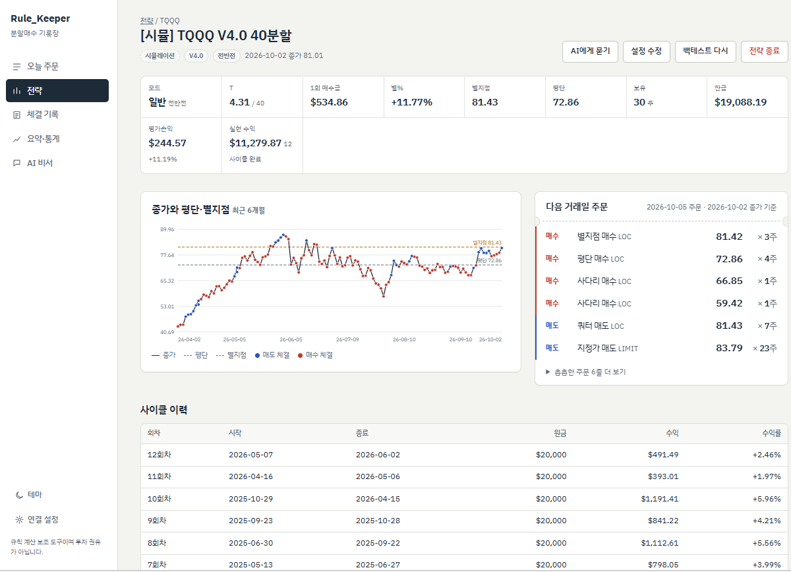 | 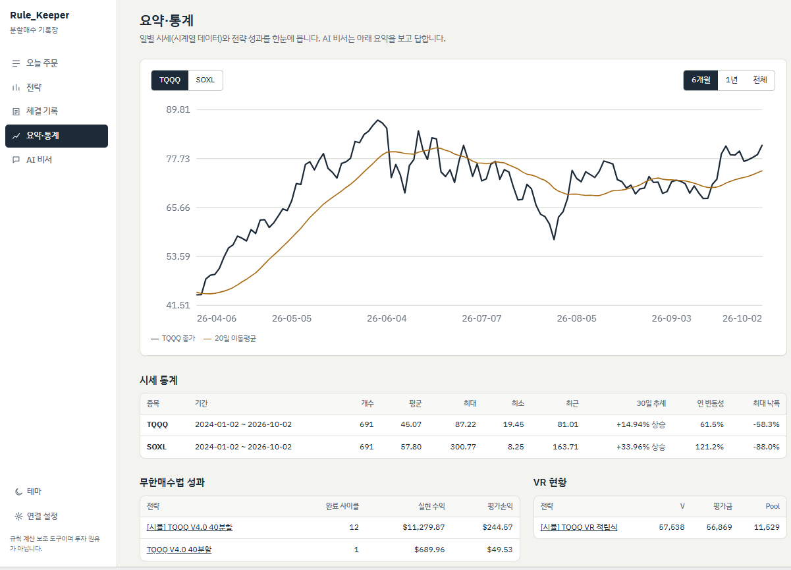 |

| 다크 모드 | 체결 기록과 내보내기 |
| --- | --- |
| 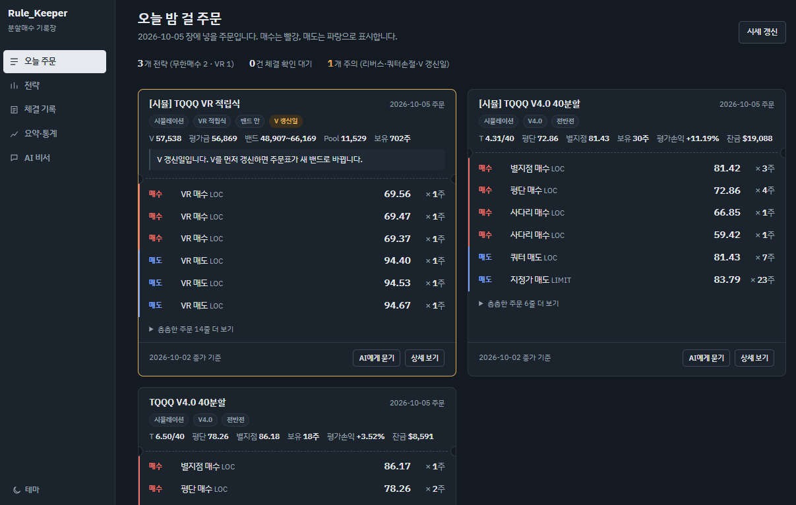 | 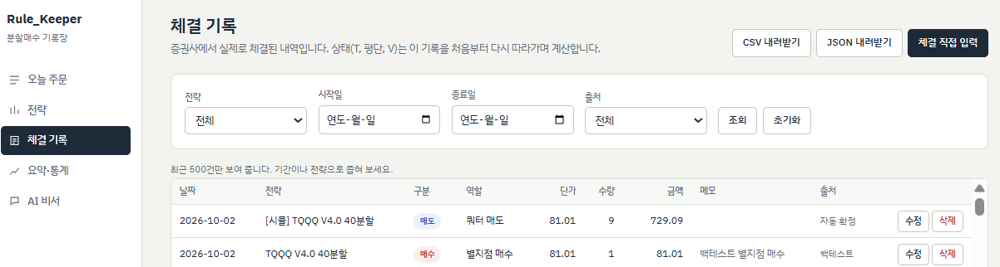 |

### 지원 규칙

> 무한매수법과 VR을 그림과 실제 화면 숫자로 쉽게 풀어 쓴 설명은 [docs/STRATEGY_GUIDE.md](docs/STRATEGY_GUIDE.md)에 있습니다.

- **무한매수법 V4.0:** 20/40분할, 별% = TQQQ 15−30T/n, SOXL 20−40T/n, 1/4 별지점 LOC + 3/4 지정가 매도, 리버스모드
- **무한매수법 V2.2:** 40분할, 1회 매수금 고정, 쿼터손절
- **VR 5.0:** 적립식·거치식·인출식, 2주마다 V' = V + Pool/G ± 적립·인출금, 밴드 ±15%, Pool 사용 한도 75/50/25%
- 공통: 사다리 LOC, 큰수 매수(증권사 가격 제한 대응), 수량 반올림 규칙, 자동 체결 판정(LOC는 종가, 지정가는 고가 기준)

---

## 4. 과제 대응표

평가 기준이 되는 과제 문서(미션 소개, 과제 목표, 기능 요구사항, 최종 결과물, 보너스)를 하나씩 대응시켰습니다.

### 4.1 과제 목표 6가지 — 스스로 설명하기

과제 목표는 "학습자가 아래를 스스로 설명할 수 있어야 한다"입니다. 각 목표를 이 프로젝트 기준으로 짧게 답하고, 자세한 설명(그림 포함)은 11장에 있습니다.

| # | 과제 목표 | 한 줄 답 (이 프로젝트에서는) | 자세히 |
| --- | --- | --- | --- |
| 1 | 시계열 데이터를 분석하고 요약 정보를 만들어 서비스에서 활용하는 흐름 | 일별 시세(날짜순 데이터)를 Firestore `prices`에 쌓고 → `build_summary()`가 기간·개수·평균·최대·최소·30일 추세와 전략 상태를 계산해 `summary.text`를 만들고 → 이 **하나의 요약**을 API·화면·AI 프롬프트가 함께 씁니다. | [11.2](#112-시계열-데이터--요약--서비스-활용) |
| 2 | FastAPI 프로젝트를 라우터/서비스 등으로 분리한 기준 | **"무엇을 다루는가"**로 나눴습니다. 라우터는 HTTP(주소·인증·검사)만, 서비스는 업무 흐름, 엔진은 매매 계산만, 저장소(repo)는 DB 읽기·쓰기만 합니다. 그래서 각 층을 따로 바꾸고 따로 테스트할 수 있습니다. | [11.3](#113-라우터--서비스--엔진--저장소-분리-기준) |
| 3 | Pydantic으로 요청 데이터 검증을 적용한 이유와 방식 | 체결 기록 한 건이 틀리면 그 뒤 상태가 모두 틀어지므로, **저장 전에** 서버에서 막아야 합니다. `schemas.py`에 `DataIn` 같은 클래스로 형식(날짜 패턴, 단가 > 0, 수량 ≥ 1, 매수/매도만)을 적으면 FastAPI가 자동으로 검사하고 틀리면 422로 거절합니다. | [11.4](#114-pydantic-요청-검증) |
| 4 | Firestore에 데이터를 저장하고 CRUD로 다루는 방법 | `data` 컬렉션에 문서(JSON 한 건)로 저장하고, `POST`(추가)·`GET`(조회)·`PUT`(수정)·`DELETE`(삭제) 4개 API가 각각 repo의 `add`·`where`·`update`·`delete`를 부릅니다. 대화는 `conversations` 컬렉션에 저장합니다. | [11.5](#115-firestore-저장-구조와-crud) |
| 5 | 데이터 요약을 시스템 프롬프트에 주입하는 방식(컨텍스트 주입)의 원리 | GPT는 우리 DB를 모르므로, **질문이 올 때마다** 서버가 최신 요약을 만들어 시스템 프롬프트의 `[요약]` 자리에 끼워 넣습니다. GPT는 그 글을 "참고 자료"로 읽고 숫자를 인용해 답합니다. | [11.6](#116-컨텍스트-주입) |
| 6 | 배포 환경에서 CORS/환경변수/키 관리가 필요한 이유 | 화면(vercel.app)과 서버(onrender.com)의 주소가 달라 **CORS 허락**이 필요하고, 로컬·배포마다 주소·키가 다르며 키를 코드에 넣으면 GitHub로 유출되므로 **환경 변수**로 분리합니다. CORS는 브라우저만 지키므로 데이터 변경 요청에는 **API 키**를 한 번 더 확인합니다. | [11.7](#117-cors--환경-변수--키-관리) |

### 4.2 최종 결과물 4가지

| 결과물 | 입력 / 요청 | 출력 / 화면 | 확인 |
| --- | --- | --- | --- |
| 1. 데이터 기반 AI 채팅 | 자연어 질문 (예: "오늘 뭐 걸어야 해?") | 저장된 데이터 요약을 반영한 답변 + "숫자를 조회하며 답을 쓰는 중" 로딩 표시 + 사용한 도구 표시 | [스크린샷 1](#5-제출-스크린샷), [6장 예시](#실제-예시) |
| 2. 데이터 관리 (CRUD) | `date, value, memo` (+ 전략, 매수/매도, 수량, 역할) 추가·수정·삭제 | 체결 기록 목록이 즉시 갱신되고 저장 결과 알림 표시 | [스크린샷 2](#5-제출-스크린샷) |
| 3. 대화 기록 저장·불러오기 | 대화 자동 저장, 목록 조회, 특정 대화 선택 | 왼쪽 대화 목록, 선택한 대화의 메시지 재표시, 이어서 질문 가능 | [스크린샷 3](#5-제출-스크린샷) |
| 4. 배포 및 문서화 | 배포 URL 접속 | Vercel 화면 접속, Render `/docs` Swagger UI, 이 README의 실행·환경 변수 안내 | [맨 위 주소표](#rule_keeper--분할매수-기록장), [10장](#10-실행과-배포) |

### 4.3 기능 요구사항 1~10

| # | 요구사항 | 구현 | 확인 방법 |
| --- | --- | --- | --- |
| 1 | 개발 환경: Python 3.10+, venv, 필수 패키지, Firebase·OpenAI 키, Render·Vercel 계정 | Python 3.11 + `backend/.venv`. 필수 패키지 5개는 `requirements.txt`. 키는 `.env`(로컬)·Render 환경 변수에만 보관 | [10장 로컬 실행](#로컬-실행) |
| 2 | 시계열 데이터 선정·100개 이상·요약 | TQQQ·SOXL **일별 종가**(2024-01-02부터, 종목별 690개 이상, yfinance) + 체결 기록. 요약: 기간, 개수, 평균, 최대, 최소, 30거래일 추세(상승/하락/유지) | `GET /api/data/summary`, 요약·통계 화면 |
| 3 | FastAPI 초기화·CORS·로컬 실행·Swagger | `app/main.py`에서 앱 생성, `CORSMiddleware` + `ALLOWED_ORIGINS`. `uvicorn app.main:app --reload` | http://127.0.0.1:8000/docs |
| 4 | Firestore 연동, 키는 환경 변수, 컬렉션 `data`·`conversations` | `repo/firestore.py`. 키는 `FIREBASE_CREDENTIALS_PATH`(파일 경로) 또는 `FIREBASE_CREDENTIALS`(JSON 문자열)로만 받음. 필수 2개 + 전략용 4개 컬렉션 | [8장 컬렉션](#firestore-컬렉션) |
| 5 | 데이터 API 5개 (CRUD 4 + summary) | `POST/GET /api/data`, `PUT/DELETE /api/data/{id}`, `GET /api/data/summary` (`text` 필드가 프롬프트 주입용) | Swagger, [9장](#9-주요-api) |
| 6 | 대화 API + 불러오기 UX | `POST/GET /api/conversations`, `DELETE /api/conversations/{id}`. 불러오기는 **(A) 방식** `GET /api/conversations/{id}`로 전체 messages 조회. 목록 응답에는 messages 대신 `message_count`만 담아 가볍게 함 | 스크린샷 3 |
| 7 | `POST /api/chat` 컨텍스트 주입 4단계 | ① `build_summary()`(= `/api/data/summary`와 같은 함수)로 요약 → ② 시스템 프롬프트 `[요약]`에 삽입 → ③ GPT 호출(도구 포함) → ④ 질문·답변을 `conversations`에 자동 저장 | [6장 처리 순서](#처리-순서-post-apichat) |
| 8 | Render 배포, `/docs` 확인, 콜드스타트 대응 | Root Directory `backend`, Secret File로 Firebase 키. 화면이 열리면 `/health`를 먼저 부르고 2.5초가 넘으면 "서버를 깨우는 중" 안내 | https://rule-keeper.onrender.com/docs |
| 9 | 바닐라 프론트: 채팅·데이터 관리·대화 기록·요약 화면 | 프레임워크 없이 HTML/CSS/JS. 해시 라우터(`#/chat` 등)로 5개 화면 전환. 채팅(입력·표시·로딩), 체결 기록(추가·수정·삭제), 대화 목록·불러오기, 요약(기간·개수·추세) | 스크린샷 1~3 |
| 10 | Vercel 배포(API 주소는 환경 변수) + README | Vercel 환경 변수 `API_BASE_URL` → 빌드 때 `build-config.js`가 `config.js` 생성. README에 소개·스택·URL·실행·환경 변수·스크린샷 포함 | 이 문서 |

### 4.4 보너스 1: AI 도구 호출(Function Calling) + 멀티채널 연동

| 요구 | 구현 | 위치 |
| --- | --- | --- |
| GPT가 내부 기능을 "도구"로 호출하도록 스키마 정의·연결 | 조회 전용 도구 5개를 JSON 스키마로 정의해 `/api/chat`에 연결. GPT가 필요할 때만 호출하고, 서버가 실행해 결과를 돌려줌 | [6장](#6-ai-호출-흐름) |
| 같은 기능을 MCP Server 또는 GPT Actions 중 1개로 연동해 호출 흐름 검증 | **MCP Server** 선택. `mcp_server/server.py`가 같은 조회 기능을 MCP 도구 5개로 공개하고, Claude 데스크톱 앱 같은 MCP 클라이언트(또는 `test_client.py`)가 호출 | [7장](#7-mcp-서버-연동-멀티채널) |
| README에 "어떤 근거로 어떤 도구를 호출했는지" + 호출 흐름 | 도구별 호출 근거 표, 질문별 실제 호출 예시, 시퀀스 다이어그램 | [6장](#6-ai-호출-흐름), [7장](#7-mcp-서버-연동-멀티채널) |

### 4.5 보너스 2: 인사이트·UX 고도화

| 요구사항 | 구현 | 위치 |
| --- | --- | --- |
| 추가 지표 1개 이상 | `GET /api/data/statistics`: **연 변동성**(일별 로그 수익률의 표준편차 × √252), **최대 낙폭**(고점 대비 최대 하락률), 전략별 실현 수익·평가손익 | 요약·통계 화면 |
| 그래프 | 종가 + 20일 이동평균(종목·기간 선택), 무한매수 전략의 종가 + 평단·별지점선 + 체결 점, VR 전략의 평가금 + V + 밴드. 외부 라이브러리 없이 SVG로 그렸습니다. | 요약·통계, 전략 상세 |
| 내보내기 | `GET /api/data/export?format=csv\|json`. 화면의 필터(전략·기간)가 그대로 적용되고, CSV는 엑셀 한글 깨짐 방지(BOM)를 넣었습니다. | 체결 기록 화면 |
| 다크 모드 | 테마 버튼으로 전환, 브라우저에 기억, 처음에는 OS 설정을 따름 | 왼쪽 아래 |
| 선택 UI | 종목·기간 선택, 체결 기록 필터, AI 비서의 대상 전략 선택 | 각 화면 |

---

## 5. 제출 스크린샷

| 데이터 요약이 보이는 채팅 (질문 + 답변) | 데이터 관리 (CRUD 동작) | 대화 기록 (불러오기 동작) |
| --- | --- | --- |
| 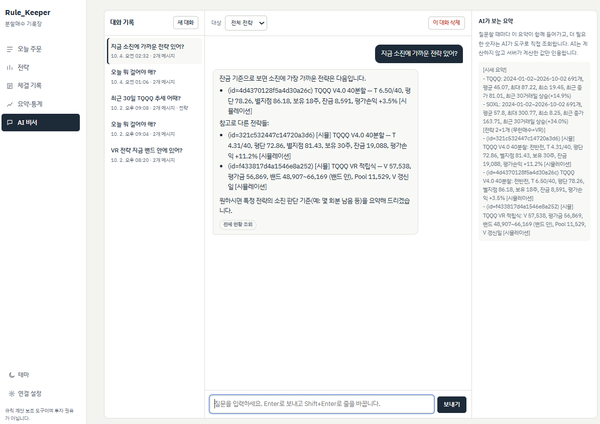 | 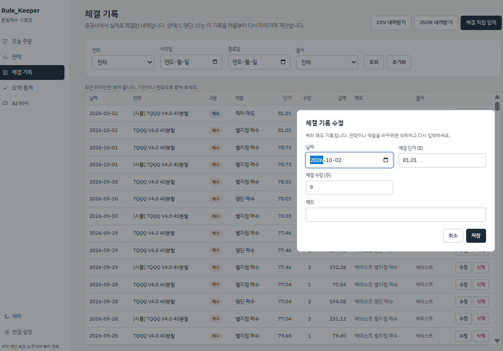 | 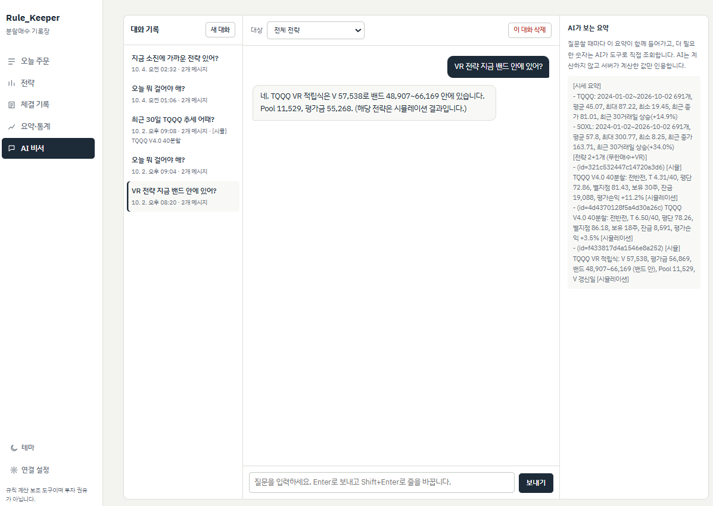 |
| 오른쪽 "AI가 보는 요약"에 기간·개수·평균·최대·최소·추세가 보이고, 가운데에 질문과 답변이 있습니다. | 체결 기록의 **수정** 창입니다. 추가·수정·삭제 결과가 목록에 바로 반영됩니다. | 왼쪽 대화 기록에서 이전 대화를 고르면 그 대화의 메시지가 다시 표시됩니다. |

이미지를 누르면 크게 볼 수 있습니다.

## 6. AI 호출 흐름

### 원칙: 숫자는 서버가, 설명은 GPT가

GPT는 Firestore에 직접 접근할 수 없고, T·평단·별지점 같은 숫자를 스스로 계산하면 틀릴 수 있습니다. 그래서

1. 서버가 Firestore를 읽고 계산하는 **함수**를 만들어 두고,
2. GPT에게는 그 함수들의 **이름과 설명(스키마)**만 알려 주며,
3. GPT가 필요하다고 판단하면 "이 함수를 이 값으로 실행해 줘"라고 **요청**하고, 실제 실행은 서버가 합니다.
4. 시스템 프롬프트로 "숫자는 요약이나 도구 결과에 있는 값만 인용하고 직접 계산하지 말 것"을 지시합니다.

### 도구 5개 (모두 조회 전용)

| 도구 | 돌려주는 것 | GPT가 호출하는 근거 (스키마 설명 기준) |
| --- | --- | --- |
| `get_portfolio_summary` | 모든 전략의 한 줄 상태 + 종목별 시세 요약 | 전체 현황, 여러 전략 비교 질문 |
| `get_strategy_status` | 전략 하나의 T, 평단, 별%, 별지점, 잔금, 모드 / VR의 V, 밴드, Pool | 특정 전략의 상세 숫자가 요약에 없을 때 (요약의 `id=` 값을 인자로 사용) |
| `get_today_orders` | 다음 거래일 주문표 (전략 지정 또는 전체) | "오늘 뭐 걸어?"처럼 주문을 묻는 질문. 주문표는 기본 요약에 없으므로 대부분 호출 |
| `get_fill_history` | 체결 기록 (기간·전략 필터, 최신순) | 과거 매매 내역을 묻는 질문 |
| `get_price_stats` | 최근 N거래일 평균·최대·최소·추세·변동성·최대 낙폭 | 요약의 30일 범위를 벗어난 기간을 묻는 질문 |

### 처리 순서 (`POST /api/chat`)

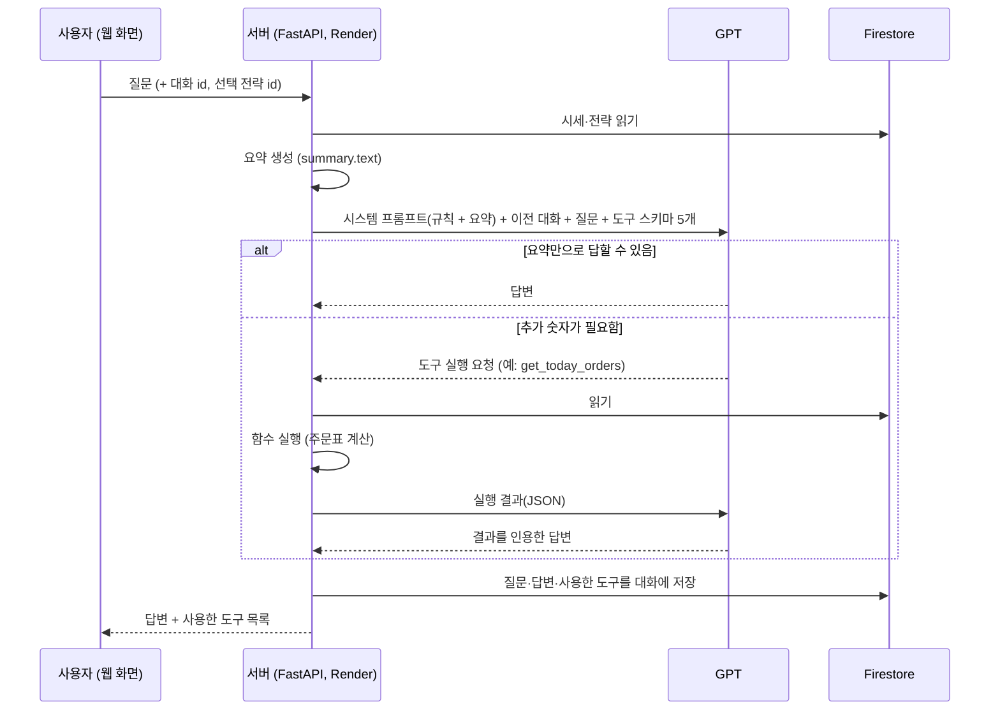
```mermaid
sequenceDiagram
    participant U as 사용자 (웹 화면)
    participant S as 서버 (FastAPI, Render)
    participant G as GPT
    participant F as Firestore

    U->>S: 질문 (+ 대화 id, 선택 전략 id)
    S->>F: 시세·전략 읽기
    S->>S: 요약 생성 (summary.text)
    S->>G: 시스템 프롬프트(규칙 + 요약) + 이전 대화 + 질문 + 도구 스키마 5개
    alt 요약만으로 답할 수 있음
        G-->>S: 답변
    else 추가 숫자가 필요함
        G-->>S: 도구 실행 요청 (예: get_today_orders)
        S->>F: 읽기
        S->>S: 함수 실행 (주문표 계산)
        S->>G: 실행 결과(JSON)
        G-->>S: 결과를 인용한 답변
    end
    S->>F: 질문·답변·사용한 도구를 대화에 저장
    S-->>U: 답변 + 사용한 도구 목록
```

- 도구 호출은 한 질문에 최대 3회까지 허용하고, 마지막에는 도구 없이 답하도록 강제합니다.
- 사용한 도구는 대화 기록의 `tools_used`에 저장되고, 화면에서는 답 아래 회색 표시로 보입니다.

### 실제 예시

| 질문 | 기본 요약에 있는가 | GPT의 판단 | 사용한 도구 |
| --- | --- | --- | --- |
| 최근 30일 TQQQ 추세 어때? | 있음 (30거래일 추세) | 요약 값을 인용해 바로 답함 | 없음 |
| 오늘 뭐 걸어야 해? | 없음 (주문표) | 주문표 도구가 필요하다고 판단 | `get_today_orders` |
| 지금 소진에 가까운 전략 있어? | 일부 (T·잔금 한 줄) | 전체 현황 → 전략별 상세 확인 | `get_portfolio_summary`, `get_strategy_status` × 2 |

아래는 "오늘 뭐 걸어야 해?"에 대한 답입니다. 답 아래의 **[주문표 조회]**가 `get_today_orders`를 호출한 기록이며, 오른쪽 "AI가 보는 요약"에는 주문표가 없다는 것을 확인할 수 있습니다.

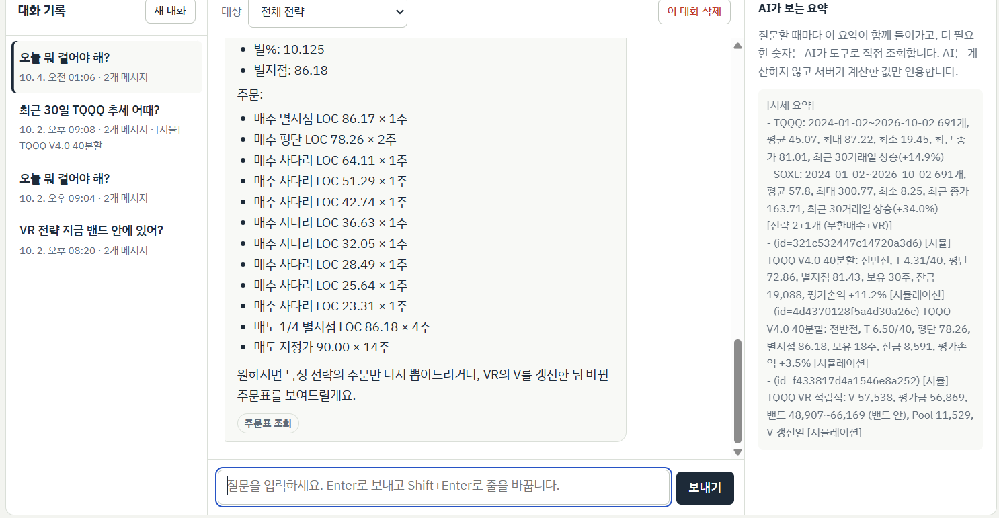

---

## 7. MCP 서버 연동 (멀티채널)

웹 화면의 AI 비서(GPT + Function Calling) 말고 **다른 AI 채널**에서도 같은 기능을 쓸 수 있게, 조회 기능을 MCP 서버로 공개했습니다.

### MCP가 뭔가요

**MCP(Model Context Protocol)**는 AI 앱이 외부 프로그램의 기능을 "도구"로 불러 쓰기 위한 **공통 규격**입니다.

- **MCP 서버:** "나는 이런 도구가 있고, 각 도구는 이런 입력을 받는다"를 규격에 맞게 알려 주고, 호출이 오면 실행해 결과를 돌려주는 프로그램 → 우리 `mcp_server/server.py`
- **MCP 클라이언트:** MCP 서버를 실행하고 도구 목록을 받아 AI에게 보여 주는 앱 → Claude 데스크톱 앱, Claude Code, 또는 검증용 `test_client.py`
- **stdio 방식:** 클라이언트가 서버 파일을 직접 실행하고, 둘이 표준 입출력(터미널 입출력)으로 JSON 메시지를 주고받습니다. 네트워크 포트를 열지 않아 설정이 단순합니다.

Function Calling과 개념은 같습니다(AI가 도구를 고르고 프로그램이 실행). 다른 점은 **Function Calling은 우리 서버 안에서 GPT와 약속한 형식**이고, **MCP는 여러 AI 앱이 함께 쓰는 표준 형식**이라 한 번 만들면 MCP를 지원하는 어떤 앱에서도 쓸 수 있다는 점입니다.

### 왜 GPT Actions가 아니라 MCP인가

| | GPT Actions | MCP Server (선택) |
| --- | --- | --- |
| 필요한 것 | ChatGPT에서 "내 GPT" 만들기 (유료 플랜 필요) | Python + `mcp` 패키지 (무료) |
| 서버 쪽 준비 | 공개 HTTPS 주소 + OpenAPI 스키마 | 내 PC에서 실행하는 작은 파이썬 파일 |
| 호출하는 쪽 | ChatGPT | Claude 데스크톱 앱, Claude Code 등 MCP 클라이언트 |

과제는 둘 중 1개를 요구하므로, 무료로 검증할 수 있는 MCP를 선택했습니다. (GPT Actions용 OpenAPI 스키마 `GET /api/actions/openapi.json`도 백엔드에 만들어 두었습니다.)

### 구성

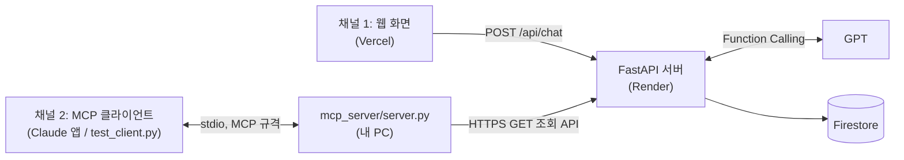
```mermaid
flowchart LR
    W["채널 1: 웹 화면<br/>(Vercel)"] -->|"POST /api/chat"| S["FastAPI 서버<br/>(Render)"]
    S <-->|Function Calling| G[GPT]
    C["채널 2: MCP 클라이언트<br/>(Claude 앱 / test_client.py)"] <-->|"stdio, MCP 규격"| M["mcp_server/server.py<br/>(내 PC)"]
    M -->|"HTTPS GET 조회 API"| S
    S --> F[(Firestore)]
```

MCP 서버는 Firestore를 직접 읽지 않고 **배포된 백엔드의 조회 API를 호출**합니다.

- 웹 화면과 **완전히 같은 계산 결과**를 받습니다 (같은 서버, 같은 서비스 함수).
- 내 PC에 Firebase 서비스 계정 키를 둘 필요가 없습니다.
- 데이터를 바꾸는 API는 노출하지 않아 `APP_API_KEY`도 필요 없습니다.

### MCP 도구 5개

| MCP 도구 | 호출하는 API | 웹 AI 비서의 같은 기능 | 호출 근거 (도구 설명) |
| --- | --- | --- | --- |
| `get_portfolio_summary` | `GET /api/data/summary` | `get_portfolio_summary` | 전체 현황·여러 전략 비교 질문에 먼저 사용. 전략 id도 여기서 얻음 |
| `get_strategy_status` | `GET /api/strategies/{id}/status` | `get_strategy_status` | 특정 전략의 T·평단·별지점 / V·밴드·Pool |
| `get_today_orders` | `GET /api/orders/today`, `GET /api/strategies/{id}/orders/next` | `get_today_orders` | "오늘 뭐 걸어야 해?" 같은 주문 질문 |
| `get_fill_history` | `GET /api/data` | `get_fill_history` | 과거 체결 내역 질문 |
| `get_statistics` | `GET /api/data/statistics` | (`get_price_stats`와 유사) | 변동성·최대 낙폭·전략 손익 질문 |

도구 설명(docstring)이 곧 AI가 도구를 고르는 **근거**입니다. 예를 들어 `get_today_orders`의 설명에 "'오늘 뭐 걸어야 해?' 같은 질문에 사용한다"고 적어 두었기 때문에, 그런 질문이 오면 AI가 이 도구를 고릅니다.

### 호출 흐름

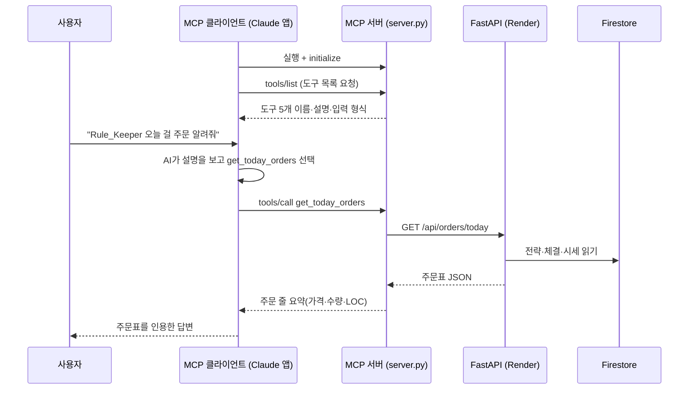
```mermaid
sequenceDiagram
    participant U as 사용자
    participant C as MCP 클라이언트 (Claude 앱)
    participant M as MCP 서버 (server.py)
    participant S as FastAPI (Render)
    participant F as Firestore
    C->>M: 실행 + initialize
    C->>M: tools/list (도구 목록 요청)
    M-->>C: 도구 5개 이름·설명·입력 형식
    U->>C: "Rule_Keeper 오늘 걸 주문 알려줘"
    C->>C: AI가 설명을 보고 get_today_orders 선택
    C->>M: tools/call get_today_orders
    M->>S: GET /api/orders/today
    S->>F: 전략·체결·시세 읽기
    S-->>M: 주문표 JSON
    M-->>C: 주문 줄 요약(가격·수량·LOC)
    C-->>U: 주문표를 인용한 답변
```

### 실행과 검증 방법

```powershell
cd backend
.venv\Scripts\activate
python -m pip install "mcp<2"            # mcp 2.x는 FastMCP 이름이 바뀌어 1.x로 고정
python ..\mcp_server\test_client.py      # 도구 목록 + get_today_orders 호출 결과 출력
python ..\mcp_server\test_client.py get_portfolio_summary
```

`test_client.py`는 Claude 앱 대신 MCP 클라이언트 역할을 하는 검증용 스크립트입니다. 서버를 실행하고, MCP 규격으로 도구 목록을 받고, 도구를 호출해 결과를 출력합니다. Claude 데스크톱 앱에 등록하는 방법은 [mcp_server/README.md](mcp_server/README.md)에 있습니다.

**검증 항목**

| 확인할 것 | 기대 결과 |
| --- | --- |
| 도구 목록 | 5개 도구 이름과 설명이 출력됨 |
| `get_today_orders` 결과 | 웹 화면 "오늘 주문"과 날짜·가격·수량이 같음 |
| Render Logs | `GET /api/orders/today` 요청이 찍힘 (MCP → 백엔드 호출 확인) |
| 오류 처리 | 없는 전략 id를 넣으면 프로그램이 멈추지 않고 `{"error": "API 오류 404: ..."}`를 돌려줌 |

**검증 결과:** _실행 화면과 웹 화면 비교 캡처를 추가할 예정입니다._

---

## 8. 구조

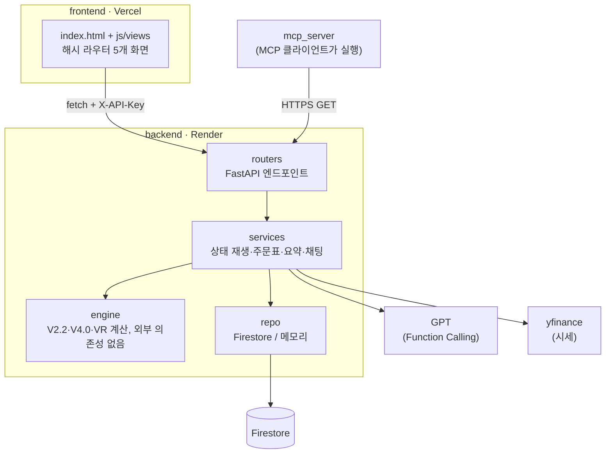
```mermaid
flowchart TB
    subgraph FE[frontend · Vercel]
        UI[index.html + js/views<br/>해시 라우터 5개 화면]
    end
    subgraph BE[backend · Render]
        R[routers<br/>FastAPI 엔드포인트] --> SV[services<br/>상태 재생·주문표·요약·채팅]
        SV --> EN[engine<br/>V2.2·V4.0·VR 계산, 외부 의존성 없음]
        SV --> RP[repo<br/>Firestore / 메모리]
    end
    UI -->|fetch + X-API-Key| R
    RP --> FS[(Firestore)]
    SV --> GPT["GPT<br/>(Function Calling)"]
    SV --> YF["yfinance<br/>(시세)"]
    MCP["mcp_server<br/>(MCP 클라이언트가 실행)"] -->|HTTPS GET| R
```

### 설계 원칙

- **사실은 저장하고 상태는 계산한다.** 설정, 체결, 주문표, VR 스냅샷만 저장하고 T·평단·별지점은 매번 체결 기록을 처음부터 재생해 구합니다. 체결 하나를 고치면 그 뒤 상태가 저절로 다시 계산됩니다.
- **숫자는 백엔드가, 설명은 GPT가.** GPT에는 계산된 요약과 읽기 전용 도구만 줍니다.
- **Firestore 무료 한도 지키기.** 조회 결과를 서버 메모리에 캐시하고, 이 서버를 거치는 쓰기가 생기면 해당 컬렉션 캐시를 비웁니다.

### Firestore 컬렉션

| 컬렉션 | 내용 |
| --- | --- |
| `strategies` | 전략 설정 (종류, 종목, 버전, 원금·분할 / V·Pool·G, 계좌 메모, 시뮬레이션 여부) |
| `data` | 체결 기록 (date, value, memo + strategy_id, side, qty, role, order_type, source) |
| `order_sheets` | 날짜별 주문표 스냅샷과 확정 여부 |
| `vr_snapshots` | VR 2주 갱신 기록 (V, 평가금, Pool, 밴드) |
| `prices` | 종목별 일별 시세 (시계열 데이터) |
| `conversations` | AI 대화 (title, strategy_id, messages[role, content, tools_used]) |

### 폴더

```
backend/
  app/
    engine/      계산 엔진: infinite.py(V2.2·V4.0), vr.py, common.py, backtest.py
    services/    상태 재생, 주문표, 체결 확정, 요약·통계, 채팅, 대화
    routers/     FastAPI 엔드포인트
    repo/        저장소 (firestore.py, memory.py)
    schemas.py   요청 검증
    main.py      앱 진입점, CORS, 라우터 등록
  scripts/seed.py  시세·데모 데이터 적재
  tests/         엔진 30개 + 서비스 19개 테스트
frontend/
  index.html     화면 뼈대
  config.js      백엔드 주소 (로컬이면 127.0.0.1:8000, 배포면 Render)
  css/style.css  라이트/다크 테마
  js/            api.js, chart.js(SVG 그래프), slip.js(주문 전표), views/(화면별 코드)
mcp_server/
  server.py      MCP 서버 (조회 도구 5개 → 백엔드 API 호출)
  test_client.py MCP 클라이언트 역할의 검증 스크립트
docs/
  STRATEGY_GUIDE.md  무한매수법·VR 쉬운 설명
  images/        README 화면 캡처
render.yaml      Render 배포 설정
```

---

## 9. 주요 API

| 메서드 · 경로 | 설명 | 키 필요 |
| --- | --- | --- |
| `GET /api/data` · `POST /api/data` | 체결 기록 목록 · 추가 | 추가만 |
| `PUT /api/data/{id}` · `DELETE /api/data/{id}` | 체결 기록 수정 · 삭제 | ✅ |
| `GET /api/data/summary` | 데이터 요약 (프롬프트 주입용 `text` 포함) | |
| `GET /api/data/statistics` | 추가 지표 (변동성, 최대 낙폭, 전략 성과) | |
| `GET /api/data/export?format=csv\|json` | 체결 기록 내보내기 | |
| `POST /api/conversations` · `GET /api/conversations` | 대화 저장 · 목록 | 저장만 |
| `GET /api/conversations/{id}` · `DELETE /api/conversations/{id}` | 대화 불러오기 · 삭제 | 삭제만 |
| `POST /api/chat` | AI 채팅 (요약 주입 → GPT·도구 → 자동 저장) | ✅ |
| `GET/POST /api/strategies`, `PUT/DELETE /api/strategies/{id}` | 전략 목록·등록·수정·종료 | 변경만 |
| `GET /api/strategies/{id}/status` | 전략 현재 상태 | |
| `GET /api/orders/today` | 전체 전략의 체결 확인 대기 + 다음 거래일 주문표 | |
| `POST /api/strategies/{id}/orders/{date}/confirm` | 자동 판정 결과(수정 포함)를 체결 기록으로 확정 | ✅ |
| `POST /api/strategies/{id}/vr/rebalance` | VR V 갱신 (`dry_run`이면 미리보기) | ✅ |
| `POST /api/strategies/{id}/backtest` | 시뮬레이션 전략 백테스트 | ✅ |
| `POST /api/prices/sync` · `GET /api/prices` | 빠진 날짜 시세 채우기 · 시세 조회 | 채우기만 |
| `GET /api/actions/openapi.json` | (참고) GPT Actions용 OpenAPI 스키마 | |
| `GET /health` | 서버 깨우기·상태 확인 (콜드스타트 대응) | |

데이터를 바꾸는 요청은 `X-API-Key` 헤더가 필요합니다. 전체 목록은 `/docs`(Swagger UI)에서 볼 수 있습니다.

---

## 10. 실행과 배포

### 로컬 실행

```bash
cd backend
python -m venv .venv            # Python 3.10 이상
.venv\Scripts\activate          # macOS/Linux: source .venv/bin/activate
pip install -r requirements.txt
copy .env.example .env          # macOS/Linux: cp .env.example .env  → 값 채우기

python -m scripts.seed --demo   # 시세 + 시뮬레이션 전략 2개 (한 번만 실행)
uvicorn app.main:app --reload   # http://127.0.0.1:8000/docs
```

화면은 다른 터미널에서 띄웁니다.

```bash
cd frontend
python -m http.server 5500      # http://127.0.0.1:5500
```

데이터를 바꾸는 요청(체결 확정, 전략 등록, 채팅)은 화면 왼쪽 아래 **연결 설정**에 `APP_API_KEY` 값을 넣어야 합니다. 키는 그 브라우저에만 저장되고 코드에는 들어가지 않습니다.

Firebase 없이 확인하려면 `.env`에서 `STORAGE=memory`로 두면 됩니다. 서버를 켤 때 데모 데이터가 자동으로 채워지고, 끄면 사라집니다.

### 환경 변수

**최소 세트**(✅)만 넣으면 Firestore + AI 채팅까지 동작합니다. 실제 값은 `.env`(로컬)와 Render 환경 변수에만 넣고, 저장소에는 값이 빈 `.env.example`만 둡니다.

백엔드 (`backend/.env`, Render Environment)

| 이름 | 최소 세트 | 용도 | 예시 / 기본값 |
| --- | :---: | --- | --- |
| `OPENAI_API_KEY` | ✅ | GPT 호출 키 (교육장 가상 키) | (비밀) |
| `OPENAI_BASE_URL` | ✅ (교육장) | OpenAI 호환 주소 | `https://copa.codyssey.kr/v1` |
| `FIREBASE_CREDENTIALS_PATH` 또는 `FIREBASE_CREDENTIALS` | ✅ | 서비스 계정 키 파일 경로, 또는 키 JSON 문자열/base64 | `/etc/secrets/serviceAccountKey.json` |
| `STORAGE` | ✅ | 저장소 종류 | `firestore` (Firebase 없이 시험: `memory`) |
| `ALLOWED_ORIGINS` | ✅ (배포) | CORS 허용 주소, 쉼표 구분, 끝에 `/` 없이 | `https://rulekeeper-frontend.vercel.app,http://127.0.0.1:5500` |
| `APP_API_KEY` | 권장 | 데이터를 바꾸는 요청에 필요한 `X-API-Key` 값 (직접 정한 비밀번호). 비우면 키 검사 안 함 | (비밀) |
| `OPENAI_MODEL` | | 모델 이름 | `gpt-5-mini` |
| `TICKERS` | | 시세를 모을 종목 | `TQQQ,SOXL` |
| `PRICE_START` | | 시세를 처음 받을 시작일 | `2024-01-01` |
| `PYTHON_VERSION` | Render만 | Render의 파이썬 버전 고정 | `3.11.9` |
| `PUBLIC_API_URL` | | (참고) GPT Actions 스키마에 들어갈 서버 주소. MCP만 쓰면 필요 없음 | |

프론트엔드 (Vercel Environment Variables)

| 이름 | 최소 세트 | 용도 |
| --- | :---: | --- |
| `API_BASE_URL` | ✅ | 백엔드 API 주소 (`https://rule-keeper.onrender.com`). 빌드 때 `build-config.js`가 이 값으로 `config.js`를 만듭니다. 없으면 저장소의 `config.js`(로컬 → `127.0.0.1:8000`, 배포 → Render)를 그대로 씁니다. |

MCP 서버 (선택)

| 이름 | 용도 | 기본값 |
| --- | --- | --- |
| `RULE_KEEPER_API` | MCP 서버가 호출할 백엔드 주소 | `https://rule-keeper.onrender.com` |

### 배포

- **Render (백엔드):** Web Service, Root Directory `backend`, Build `pip install -r requirements.txt`, Start `uvicorn app.main:app --host 0.0.0.0 --port $PORT`, `PYTHON_VERSION=3.11.9`. Firebase 키 파일은 Secret File(`/etc/secrets/serviceAccountKey.json`)로 넣고 `FIREBASE_CREDENTIALS_PATH`로 가리킵니다.
- **Vercel (프론트엔드):** Root Directory `frontend`, Framework Preset `Other`. `frontend/vercel.json`이 빌드 명령(`node build-config.js`)과 출력 폴더(`.`)를 지정하고, 환경 변수 `API_BASE_URL`에 Render 주소를 넣습니다.
- **보안:** `.env`와 서비스 계정 키는 `.gitignore`로 저장소에서 제외했습니다. API 키는 코드·README·캡처에 넣지 않습니다.

### 테스트

```bash
cd backend
python -m unittest discover -s tests -t .
```

- **엔진 테스트 30개:** 라오어 카페 원문의 예시 표(T, 별%, 주문 가격·수량)를 그대로 재현하는지, 백테스트가 끝까지 도는지 확인합니다.
- **서비스 테스트 19개:** 메모리 저장소로 체결 확정 → 상태 재계산, 대화 저장·불러오기, 요약 생성, 장중 시세 제외, 오래된 주문표 정리 같은 흐름을 확인합니다.
- Firestore·OpenAI 없이 돌아가므로(저장소를 `memory`로 교체) 키 없이도 누구나 실행할 수 있습니다.

---

## 11. 설계 설명

### 11.1 용어 정리

이 문서와 코드에 나오는 개발 용어를 먼저 짧게 정리합니다.

| 용어 | 뜻 | 이 프로젝트에서 |
| --- | --- | --- |
| **API** | 프로그램끼리 데이터를 주고받는 약속된 창구 | 화면(프론트)이 서버에 "체결 기록 줘", "채팅 보내 줘"를 요청하는 통로 |
| **엔드포인트** | API 하나의 주소 + 방식 | `GET /api/data/summary`, `POST /api/chat` 등 |
| **HTTP 메서드** | 요청의 종류. GET(조회), POST(추가), PUT(수정), DELETE(삭제) | CRUD 4개가 각각 하나씩 대응 |
| **JSON** | `{"date": "2026-10-02", "value": 81.01}`처럼 이름과 값을 묶은 텍스트 형식 | 서버와 화면, 서버와 GPT가 주고받는 데이터 형식 |
| **CRUD** | Create(추가)·Read(조회)·Update(수정)·Delete(삭제) | 체결 기록 API 4개 |
| **FastAPI** | 파이썬으로 웹 API 서버를 만드는 라이브러리 | 주소와 함수 연결, 요청 검사, JSON 변환, Swagger 자동 생성 |
| **Uvicorn** | FastAPI 앱을 실제로 실행해 요청을 받게 하는 서버 프로그램 | `uvicorn app.main:app` |
| **Swagger UI / OpenAPI** | OpenAPI는 API 목록·입력·출력을 적는 표준 형식, Swagger UI는 그걸 웹 화면으로 보여 주고 직접 실행해 보게 하는 도구 | `/docs` 화면 |
| **Pydantic** | 데이터의 모양(필드, 타입, 범위)을 클래스로 정의하고 자동 검사하는 라이브러리 | `schemas.py`의 `DataIn`, `StrategyIn`, `ChatIn` |
| **422 오류** | "요청 형식이 규칙에 맞지 않음" 응답 코드 | 날짜 형식이 틀리거나 수량이 0이면 저장 전에 거절 |
| **Firestore** | 구글 Firebase의 클라우드 NoSQL 데이터베이스. 표 대신 **컬렉션**(문서 묶음)과 **문서**(JSON 같은 한 건)로 저장 | `data`, `conversations` 등 6개 컬렉션 |
| **서비스 계정 키** | 서버가 Firestore에 접근할 때 쓰는 관리자용 열쇠 파일(JSON) | `.env`·Render Secret File에만 보관 |
| **환경 변수 / .env** | 코드 밖에서 프로그램에 넘겨주는 설정 값. `.env`는 로컬에서 그 값을 적어 두는 파일 | 키, 주소, 저장소 종류(`STORAGE`) |
| **CORS** | 브라우저가 "다른 주소의 서버"에 요청할 때 그 서버가 허락했는지 확인하는 보안 규칙 | Vercel 화면 → Render 서버 요청을 `ALLOWED_ORIGINS`로 허락 |
| **API 키 (`X-API-Key`)** | 요청 헤더에 담아 보내는 비밀 값. 서버가 같은 값인지 확인 | 데이터를 바꾸는 요청에만 요구 |
| **시스템 프롬프트** | GPT에게 대화 맨 앞에 주는 지시문(역할, 규칙, 참고 자료) | 규칙 요약 + 데이터 요약 |
| **컨텍스트 주입** | 시스템 프롬프트에 내 데이터를 넣어 GPT가 그 데이터를 바탕으로 답하게 하는 방식 | 매 질문마다 최신 요약을 `[요약]` 자리에 넣음 |
| **Function Calling** | GPT가 답 대신 "이 함수를 이 값으로 실행해 줘"라고 요청하고, 서버가 실행 결과를 돌려주는 방식 | 조회 도구 5개 |
| **콜드스타트** | 무료 서버가 잠들어 있다가 첫 요청에 깨어나느라 느려지는 현상 | 화면에 "서버를 깨우는 중" 안내 |
| **MCP** | Model Context Protocol. AI 앱이 외부 프로그램의 기능을 도구로 쓰게 하는 표준 규격 | `mcp_server/server.py`가 조회 도구 5개를 공개 |
| **stdio** | 표준 입출력. 프로그램이 터미널로 글을 읽고 쓰는 통로 | MCP 클라이언트와 서버가 JSON 메시지를 주고받는 길 |
| **시계열 데이터** | 시간 순서대로 쌓이는 데이터. 순서 자체가 의미를 가짐 | 날짜별 종가(`prices`), 날짜별 체결 기록(`data`) |
| **이동평균** | 최근 N일 값의 평균을 하루씩 밀며 계산한 선. 들쭉날쭉한 값을 부드럽게 보여 줌 | 요약·통계 그래프의 20일 이동평균선 |
| **변동성** | 가격이 얼마나 크게 출렁이는지. 일별 수익률의 표준편차로 계산 | 추가 지표 "연 변동성" |
| **최대 낙폭(MDD)** | 기간 중 가장 높았던 값에서 가장 많이 떨어진 비율 | 추가 지표 "최대 낙폭" |
| **NoSQL / 문서형 DB** | 표(행·열) 대신 JSON 같은 문서를 저장하는 DB. 칸 구성을 미리 정하지 않아도 됨 | Firestore |
| **캐시** | 자주 읽는 결과를 잠시 메모리에 보관해 다시 읽지 않는 것 | Firestore 읽기 횟수 절약 (10분, 쓰기 시 비움) |
| **미들웨어** | 모든 요청이 라우터에 닿기 전·후에 공통으로 거치는 처리 | `CORSMiddleware` |
| **해시 라우터** | 주소의 `#` 뒤(`#/chat`)만 바꿔 화면을 전환하는 방식. 페이지를 새로 불러오지 않음 | 프론트엔드 5개 화면 전환 |
| **LOC 주문** | Limit On Close. 장 마감 종가가 지정가 조건을 만족하면 종가로 체결되는 주문 | 무한매수법 매수 주문, 자동 판정 기준(종가) |

### 11.2 시계열 데이터 → 요약 → 서비스 활용

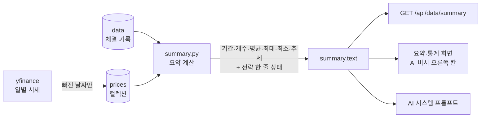
```mermaid
flowchart LR
    Y[yfinance<br/>일별 시세] -->|빠진 날짜만| P[(prices<br/>컬렉션)]
    D[(data<br/>체결 기록)] --> SM
    P --> SM[summary.py<br/>요약 계산]
    SM -->|기간·개수·평균·최대·최소·추세<br/>+ 전략 한 줄 상태| T["summary.text"]
    T --> A["GET /api/data/summary"]
    T --> B[요약·통계 화면<br/>AI 비서 오른쪽 칸]
    T --> C[AI 시스템 프롬프트]
```

1. `services/prices.py`가 yfinance에서 TQQQ·SOXL 일별 시세를 받아 `prices` 컬렉션에 저장합니다. 이미 있는 날짜는 건너뛰고 빠진 날짜만 채웁니다. 화면에 접속할 때와 **시세 갱신** 버튼을 누를 때 실행됩니다.
2. `services/summary.py`가 종목별 기간, 개수, 평균, 최대, 최소, 최근 30거래일 변화율과 추세(+3% 초과 상승, −3% 미만 하락, 그 사이 유지)를 계산하고, 전략별 현재 상태를 한 줄씩 덧붙여 `text`로 만듭니다.
3. 같은 요약이 API, 화면, AI 프롬프트 세 곳에서 그대로 쓰이므로 사람이 보는 숫자와 AI가 보는 숫자가 항상 같습니다.

**요약에 들어가는 지표와 계산 방법**

| 지표 | 계산 | 왜 필요한가 |
| --- | --- | --- |
| 기간·개수 | 첫 날짜 ~ 마지막 날짜, 행 수 | 데이터가 충분한지(100개 이상), 최신인지 확인 |
| 평균·최대·최소 | 종가의 평균·최댓값·최솟값 | 지금 가격이 과거 범위의 어디쯤인지 |
| 30거래일 추세 | (오늘 종가 ÷ 30거래일 전 종가 − 1) × 100. +3% 초과 상승, −3% 미만 하락, 그 사이 유지 | "요즘 오르는 중이야?" 질문에 한 단어로 답하기 위해 |
| 연 변동성 (통계 API) | 일별 로그 수익률 ln(오늘/어제)의 표준편차 × √252 (1년 거래일 수) | 3배 레버리지 ETF가 얼마나 거칠게 움직이는지 |
| 최대 낙폭 (통계 API) | 지금까지의 최고가를 따라가며 (종가 ÷ 최고가 − 1)의 최솟값 | 최악의 경우 얼마나 빠졌는지 → 분할 매수의 필요성 |
| 전략 한 줄 상태 | 체결 기록을 처음부터 재생해 T·평단·별지점 / V·밴드·Pool 계산 | AI가 "내 상황"을 알게 하는 핵심 |

**시계열 데이터 품질 관리**

시계열은 "날짜마다 값이 정확히 하나"여야 계산이 맞습니다. 그래서 수집 단계에서 다음을 지킵니다.

- **빠진 날짜만 채우기:** 이미 저장된 날짜는 다시 받지 않아 yfinance 호출과 Firestore 쓰기를 줄입니다.
- **장중 가격 제외:** 미국 동부 시간 17시 전에는 오늘 값이 아직 "종가"가 아니므로 저장하지 않고, 실수로 저장된 장중 값은 지웁니다. (실제로 장중 가격이 종가처럼 저장돼 주문표 날짜가 틀어진 문제를 겪고 고쳤습니다 → [13장](#13-개발-중-겪은-문제와-해결))
- **최근 7일 다시 확인:** 데이터 제공처가 나중에 값을 고치는 경우가 있어, 최근 7일은 다시 받아 바뀐 값을 갱신합니다.
- **시간대:** 미국 장 기준 날짜를 쓰기 위해 `America/New_York` 시간대로 계산합니다(`tzdata`).

| 장점 | 단점 |
| --- | --- |
| 요약 하나를 API·화면·AI가 공유해 숫자가 어긋나지 않음 | 요약 형식을 바꾸면 세 곳에 모두 영향 |
| 요약은 짧은 글이라 GPT에 매번 넣어도 부담이 적음 | 요약에 없는 세부 숫자는 도구 호출이 필요 (→ Function Calling으로 보완) |

### 11.3 라우터 / 서비스 / 엔진 / 저장소 분리 기준


```mermaid
flowchart TB
    REQ([HTTP 요청]) --> RT
    subgraph BE["백엔드"]
        RT["routers/<br/>주소 정의 · API 키 확인 · Pydantic 검사"]
        SV["services/<br/>업무 흐름 조합 · GPT 호출"]
        EN["engine/<br/>매매 규칙 계산 (순수 파이썬)"]
        RP["repo/<br/>저장소 읽기·쓰기"]
        RT --> SV
        SV --> EN
        SV --> RP
    end
    RP --> FS[(Firestore)]
    RP -.->|"STORAGE=memory"| MEM[(메모리)]
```

| 층 | 폴더 | 기준 | 이렇게 나눈 이유 |
| --- | --- | --- | --- |
| 라우터 | `routers/` | HTTP만 다룸: 주소 정의, API 키 확인, 요청 검사 후 서비스 호출 | 주소나 인증 방식이 바뀌어도 계산 코드는 그대로 |
| 서비스 | `services/` | 업무 흐름: 저장소에서 읽고 엔진으로 계산해 결과를 조합, GPT 호출 | 화면·AI·Actions가 같은 함수를 공유 |
| 엔진 | `engine/` | 매매 규칙 계산만. DB·웹을 모름 | 카페 원문 예시 표로 단독 테스트 가능 |
| 저장소 | `repo/` | 읽기·쓰기만. Firestore와 메모리 구현이 같은 함수 이름(`get`, `where`, `put`, `update`, `delete`) | `STORAGE` 값 하나로 저장소 교체, Firebase 없이 개발 가능 |

**요청 하나가 층을 지나는 예** (`GET /api/strategies/{id}/status`)

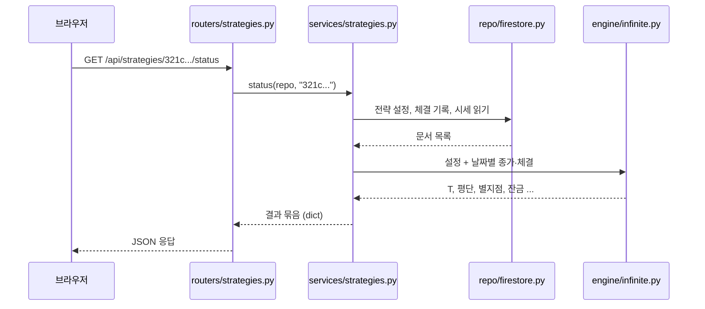
```mermaid
sequenceDiagram
    participant B as 브라우저
    participant R as routers/strategies.py
    participant S as services/strategies.py
    participant P as repo/firestore.py
    participant E as engine/infinite.py
    B->>R: GET /api/strategies/321c.../status
    R->>S: status(repo, "321c...")
    S->>P: 전략 설정, 체결 기록, 시세 읽기
    P-->>S: 문서 목록
    S->>E: 설정 + 날짜별 종가·체결
    E-->>S: T, 평단, 별지점, 잔금 ...
    S-->>R: 결과 묶음 (dict)
    R-->>B: JSON 응답
```

**나누면 좋은 점과 비용**

| 장점 | 단점 / 비용 |
| --- | --- |
| 같은 서비스 함수를 웹 화면 API, AI 도구, MCP가 함께 씀 (`status()` 하나로 세 채널) | 파일과 함수가 많아져 처음 보는 사람은 흐름을 따라가기 어려움 |
| 엔진은 DB·웹 없이 테스트 가능 → 카페 원문 예시 표로 30개 테스트 | 간단한 기능도 라우터·서비스 두 곳을 고쳐야 할 때가 있음 |
| `STORAGE=memory`로 Firebase 없이 개발·테스트 | 저장소 두 구현(Firestore·메모리)의 동작을 똑같이 맞춰야 함 |

**한 파일(`main.py`)에 다 넣었다면?** 처음엔 빠르지만, 주소 처리·계산·DB 코드가 섞여 계산 규칙 하나를 고치려면 HTTP 코드까지 읽어야 하고, Firestore 없이 테스트할 수 없습니다. 이 앱은 매매 규칙 계산이 핵심이라 엔진을 분리하는 이점이 특히 컸습니다.

### 11.4 Pydantic 요청 검증

`schemas.py`에 요청 모양을 클래스로 정의하면, FastAPI가 요청이 들어올 때 자동으로 검사합니다.

```python
class DataIn(BaseModel):
    date: str = Field(pattern=r"^\d{4}-\d{2}-\d{2}$")   # YYYY-MM-DD 형식만
    value: float = Field(gt=0)                           # 체결 단가 > 0
    qty: int = Field(ge=1)                               # 수량 1주 이상
    side: Literal["buy", "sell"]                         # 매수/매도만
    ...
```

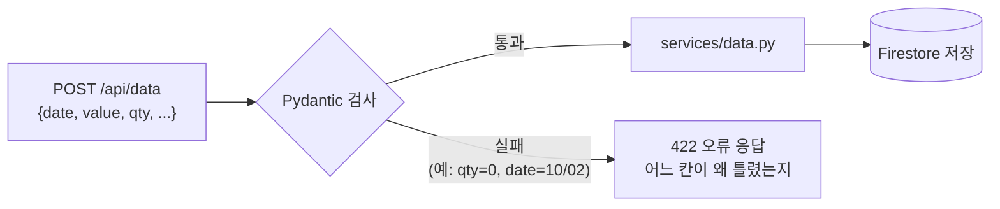
```mermaid
flowchart LR
    Q["POST /api/data<br/>{date, value, qty, ...}"] --> V{Pydantic 검사}
    V -->|통과| SV[services/data.py] --> FS[(Firestore 저장)]
    V -->|"실패<br/>(예: qty=0, date=10/02)"| E[422 오류 응답<br/>어느 칸이 왜 틀렸는지]
```

- `StrategyIn`은 "V4.0은 20·40분할만", "VR은 시작 V와 Pool 필수" 같은 규칙도 검사합니다.
- **이유:** 이 앱은 체결 기록을 처음부터 다시 따라가며 상태를 계산하므로, 잘못된 기록이 한 건만 들어가도 그 뒤의 T·평단이 모두 틀어집니다. 검사를 저장 **전**에 해서 틀린 데이터가 Firestore에 들어가지 않게 막습니다.

#### 왜 프론트엔드(JS)가 아니라 백엔드에서 검사하나

프론트엔드도 검사를 합니다. 체결 입력 창의 `required`, `min="1"`, 체결 확정 때 "체결가와 수량을 모두 입력하세요" 안내가 그것입니다. 하지만 **프론트엔드 검사만으로는 막을 수 없는 경로**가 있어서 최종 검사는 백엔드가 맡습니다.


```mermaid
flowchart LR
    W["웹 화면<br/>(JS 검사 있음)"] --> API
    SW["Swagger UI /docs"] --> API
    GA["MCP 서버<br/>(Claude 앱 등)"] --> API
    CL["curl · 스크립트 등<br/>직접 호출"] --> API
    DT["개발자 도구로<br/>JS를 고친 브라우저"] --> API
    API{"백엔드<br/>Pydantic 검사"} -->|통과| DB[(Firestore)]
    API -->|실패| X[422 거절]
```

| | 프론트엔드 검사 (JS) | 백엔드 검사 (Pydantic) |
| --- | --- | --- |
| 목적 | 사용자 편의: 서버에 보내기 전에 바로 알려 줌 | 데이터 보호: 어디서 오든 마지막 관문 |
| 적용 범위 | 우리 웹 화면에서 보낸 요청만 | API로 들어오는 **모든** 요청 |
| 우회 가능 여부 | 가능 (개발자 도구로 JS 수정, Swagger·curl로 직접 호출) | 불가능 (서버 안에서 실행) |
| 이 프로젝트 예 | `min="1"`, 빈 칸 안내 | `DataIn`, `StrategyIn`, `ChatIn` |

실제로 개발 중 Swagger UI에서 형식이 깨진 JSON을 `/api/chat`에 보냈을 때, 웹 화면을 거치지 않았는데도 백엔드가 422로 거절했습니다. 또 같은 API를 MCP 서버(다른 AI 채널)도 호출하므로, 검사를 JS에만 두면 웹 화면 외의 경로는 무방비가 됩니다. 그래서 **프론트엔드 검사는 편의, 백엔드 검사는 보안·정확성**으로 역할을 나눴습니다.

**방식 정리**

1. `schemas.py`에 `BaseModel`을 상속한 클래스로 필드·타입·조건(`Field(gt=0)`, `pattern`, `Literal`)을 적습니다.
2. 라우터 함수의 매개변수 타입으로 그 클래스를 씁니다: `def create(body: DataIn)`.
3. FastAPI가 요청 JSON을 클래스로 바꾸면서 자동 검사합니다. 통과하면 함수가 실행되고, 실패하면 함수는 실행되지도 않고 422가 나갑니다.
4. 같은 클래스로 Swagger 문서의 입력 예시·설명도 자동으로 만들어집니다.

예: 수량 0으로 체결을 추가하면

```json
{"detail": [{"type": "greater_than_equal", "loc": ["body", "qty"],
             "msg": "Input should be greater than or equal to 1", "input": 0}]}
```

어느 칸(`loc`)이 왜(`msg`) 틀렸는지 알려 주므로, 화면은 이 내용을 그대로 사용자에게 보여 줄 수 있습니다.

| 장점 | 단점 |
| --- | --- |
| 검사 코드를 `if`문으로 직접 쓰지 않아 짧고 실수가 적음 | 복잡한 규칙(전략 종류별 필수 칸)은 `model_validator`로 따로 작성해야 함 |
| 검사 규칙 = API 문서(Swagger)라 문서와 실제가 어긋나지 않음 | 기본 오류 메시지가 영어라 화면에서 한 번 더 다듬어야 함 |

### 11.5 Firestore 저장 구조와 CRUD

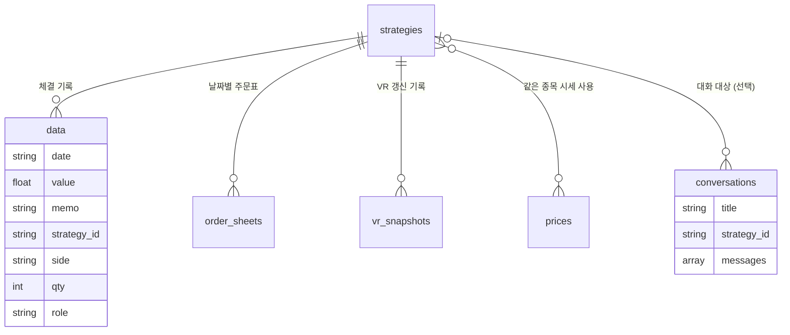
```mermaid
erDiagram
    strategies ||--o{ data : "체결 기록"
    strategies ||--o{ order_sheets : "날짜별 주문표"
    strategies ||--o{ vr_snapshots : "VR 갱신 기록"
    strategies }o--o{ prices : "같은 종목 시세 사용"
    strategies |o--o{ conversations : "대화 대상 (선택)"
    data {
        string date
        float value
        string memo
        string strategy_id
        string side
        int qty
        string role
    }
    conversations {
        string title
        string strategy_id
        array messages
    }
```

| 화면 동작 | API | 서비스 함수 | repo 함수 | Firestore |
| --- | --- | --- | --- | --- |
| 체결 직접 입력 | `POST /api/data` | `create_data` | `add` | `data`에 문서 추가 |
| 목록 보기·필터 | `GET /api/data` | `list_data` | `where` | `data` 조회 |
| 수정 | `PUT /api/data/{id}` | `update_data` | `update` | 날짜·단가·수량·메모만 변경 |
| 삭제 | `DELETE /api/data/{id}` | `delete_data` | `delete` | 문서 삭제 |

수정은 날짜·단가·수량·메모만 허용하고, 전략이나 역할을 바꾸려면 삭제 후 다시 추가하게 해서 기록의 일관성을 지킵니다. 무료 한도(읽기 하루 5만 건)를 지키려고 `repo/firestore.py`가 조회 결과를 서버 메모리에 캐시하고, 쓰기가 생기면 해당 컬렉션 캐시를 비웁니다.

**왜 Firestore(NoSQL)인가**

| | Firestore (문서형) | 관계형 DB (예: PostgreSQL) |
| --- | --- | --- |
| 데이터 모양 | 문서마다 칸이 달라도 됨 → 무한매수(T, 분할)와 VR(V, Pool, G) 설정을 한 컬렉션에 저장 | 표의 칸을 미리 정해야 함 → 전략 종류별 표나 빈 칸이 많아짐 |
| 대화 저장 | 대화 문서 안에 `messages` 배열을 통째로 저장 → 불러오기 1번 읽기 | 대화 표 + 메시지 표로 나누고 JOIN |
| 집계·조인 | 약함 (합계·평균은 서버 코드로 계산) | 강함 (SQL로 계산) |
| 운영 | 서버 설치 없음, 무료 한도(읽기 하루 5만 건) | 서버·접속 관리 필요 |

이 앱은 계산을 어차피 파이썬 엔진이 하므로 DB의 집계 기능이 필요 없고, 전략마다 설정 모양이 달라 문서형이 잘 맞습니다.

**문서 id:** 서버가 겹치지 않는 임의 id(uuid 20자리)를 만들어 문서 이름으로 쓰고, 응답에 `id`로 넣어 줍니다. Firestore·메모리 저장소가 같은 방식으로 id를 만들어 두 저장소의 동작이 같습니다. 화면은 이 id로 `PUT/DELETE /api/data/{id}`, `GET /api/conversations/{id}`를 부릅니다.

**캐시:** Render 서버 한 대가 모든 쓰기를 담당하므로, 조회 결과를 10분 동안 서버 메모리에 보관하고 이 서버를 거친 쓰기(추가·수정·삭제)가 생기면 그 컬렉션 캐시를 바로 비웁니다. 화면이 여러 번 새로 고쳐져도 Firestore 읽기는 거의 늘지 않습니다. (단점: Firebase 콘솔에서 직접 고친 값은 최대 10분 늦게 보입니다.)

### 11.6 컨텍스트 주입

GPT는 우리 Firestore를 모르므로, 질문이 올 때마다 서버가 최신 요약을 만들어 시스템 프롬프트에 끼워 넣습니다.

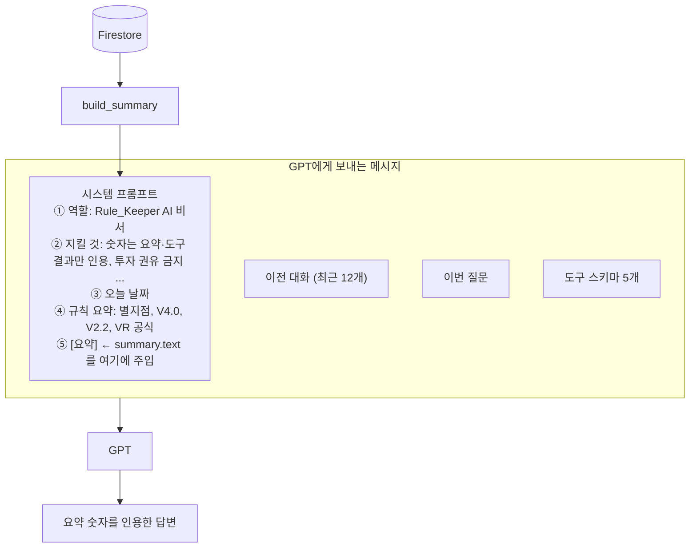
```mermaid
flowchart TB
    subgraph SP[GPT에게 보내는 메시지]
        direction TB
        S1["시스템 프롬프트<br/>① 역할: Rule_Keeper AI 비서<br/>② 지킬 것: 숫자는 요약·도구 결과만 인용, 투자 권유 금지 ...<br/>③ 오늘 날짜<br/>④ 규칙 요약: 별지점, V4.0, V2.2, VR 공식<br/>⑤ [요약] ← summary.text 를 여기에 주입"]
        S2["이전 대화 (최근 12개)"]
        S3["이번 질문"]
        S4["도구 스키마 5개"]
    end
    FS[(Firestore)] --> SUM[build_summary] --> S1
    SP --> G[GPT] --> ANS[요약 숫자를 인용한 답변]
```

- **효과:** 일반 ChatGPT는 "오늘 내 T가 몇이야?"에 답할 수 없지만, 이 서비스는 요약 안의 `T 4.31/40, 평단 72.86 ...`을 그대로 인용해 답합니다.
- **환각 방지:** "직접 계산·추정하지 말고 값이 없으면 도구를 호출하라"고 지시해, 요약에 없는 숫자는 Function Calling으로 서버에서 받아 옵니다.
- **전략 선택:** AI 비서에서 대상 전략을 고르면 그 전략의 상세 상태와 오늘 주문표까지 요약에 넣습니다.

**컨텍스트 주입 vs Function Calling vs RAG**

| 방식 | 원리 | 장점 | 단점 | 이 프로젝트 |
| --- | --- | --- | --- | --- |
| 컨텍스트 주입 | 요약을 매번 프롬프트에 넣음 | 단순, 도구 호출 없이 바로 답함, 항상 최신 | 프롬프트 길이 한계 → 요약만 넣을 수 있음 | 필수 과제. 기본 요약 |
| Function Calling | GPT가 필요할 때만 함수 실행을 요청 | 필요한 데이터만 정확히 가져옴 | 호출 왕복만큼 느려짐, 도구 설명을 잘 써야 함 | 보너스 1. 주문표·상세 상태 |
| RAG (검색 증강) | 문서를 잘게 나눠 저장하고 질문과 비슷한 조각을 검색해 넣음 | 긴 문서(매뉴얼 등)에 강함 | 벡터 DB 등 준비가 많고, 숫자 계산엔 약함 | 사용 안 함 (숫자 계산이 핵심이라 부적합) |

두 방식을 함께 쓴 이유: 자주 묻는 현황(T, 평단, 추세)은 요약에 넣어 **빠르게** 답하고, 요약에 없는 큰 데이터(주문표, 체결 내역)는 도구로 **필요할 때만** 가져와 프롬프트가 길어지지 않게 했습니다.

**프롬프트 설계에서 지킨 것**

- 숫자는 요약·도구 결과에 있는 값만 인용하고 직접 계산하지 않기
- 영어 필드 이름(`star_buy` 등) 대신 우리말(별지점 매수)로 답하기
- 투자 권유가 아니라 규칙 설명이라는 점 밝히기
- 이전 대화는 최근 12개만 보내 길이 조절

### 11.7 CORS · 환경 변수 · 키 관리

**CORS가 필요한 이유**

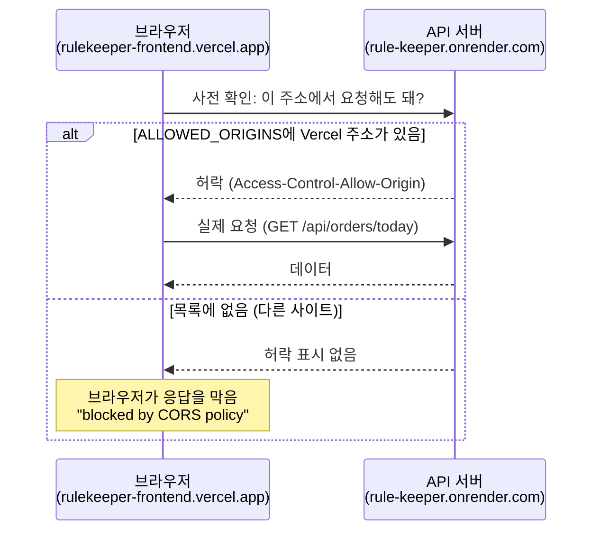
```mermaid
sequenceDiagram
    participant B as 브라우저<br/>(rulekeeper-frontend.vercel.app)
    participant S as API 서버<br/>(rule-keeper.onrender.com)
    B->>S: 사전 확인: 이 주소에서 요청해도 돼?
    alt ALLOWED_ORIGINS에 Vercel 주소가 있음
        S-->>B: 허락 (Access-Control-Allow-Origin)
        B->>S: 실제 요청 (GET /api/orders/today)
        S-->>B: 데이터
    else 목록에 없음 (다른 사이트)
        S-->>B: 허락 표시 없음
        Note over B: 브라우저가 응답을 막음<br/>"blocked by CORS policy"
    end
```

화면(vercel.app)과 서버(onrender.com)의 주소가 다르기 때문에, 서버가 허락한 주소의 화면만 데이터를 읽을 수 있습니다. `ALLOWED_ORIGINS`에는 Vercel 주소와 로컬 개발 주소만 넣었습니다.

**비밀 값은 어디에 있나**

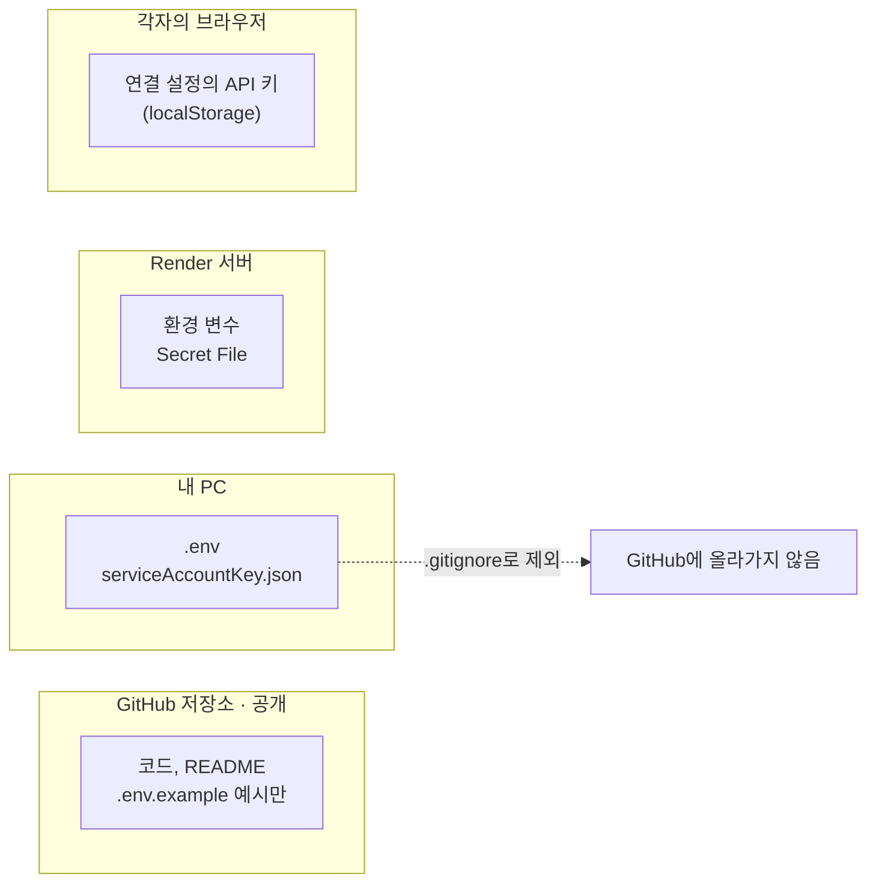
```mermaid
flowchart LR
    subgraph GIT[GitHub 저장소 · 공개]
        C[코드, README<br/>.env.example 예시만]
    end
    subgraph LOCAL[내 PC]
        E[".env<br/>serviceAccountKey.json"]
    end
    subgraph RENDER[Render 서버]
        RE["환경 변수<br/>Secret File"]
    end
    subgraph BROWSER[각자의 브라우저]
        K["연결 설정의 API 키<br/>(localStorage)"]
    end
    E -.->|".gitignore로 제외"| NG["GitHub에 올라가지 않음"]
```

| 값 | 보관 위치 | 노출되면 생기는 일 |
| --- | --- | --- |
| OpenAI 키 | `.env`, Render 환경 변수 | 남이 GPT를 호출해 비용·사용량을 씀 |
| Firebase 서비스 계정 키 | `serviceAccountKey.json`(로컬), Render Secret File | 남이 DB를 마음대로 읽고 고침 |
| `APP_API_KEY` | `.env`, Render 환경 변수, 각자 브라우저 | 남이 체결 기록을 추가·삭제함 |
| API 서버 주소 | Vercel 환경 변수 `API_BASE_URL` | 공개 정보 (비밀 아님) |

- **환경 변수를 쓰는 이유:** 로컬과 배포 환경에서 주소·키가 다르므로, 코드를 고치지 않고 실행 환경마다 값만 바꿔 끼웁니다. 또 코드에 키를 적지 않으니 GitHub에 올려도 안전합니다.
- **API 키를 한 번 더 두는 이유:** CORS는 **브라우저**만 지키는 규칙이라, 프로그램으로 직접 요청하면 막지 못합니다. 그래서 데이터를 바꾸는 요청은 `X-API-Key`가 맞아야만 처리합니다.

**API 키 확인 흐름**

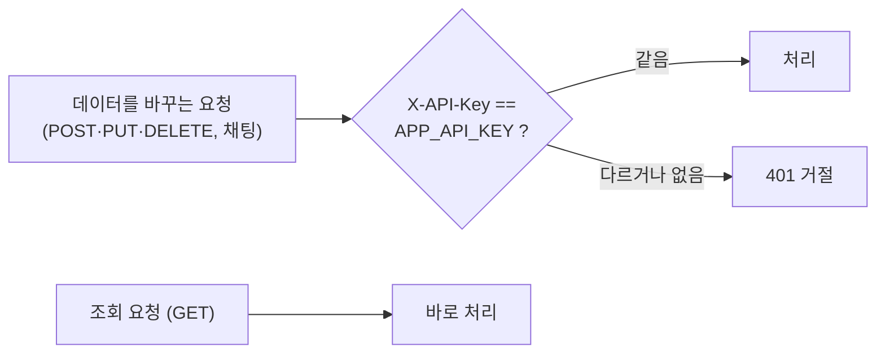
```mermaid
flowchart LR
    R["데이터를 바꾸는 요청<br/>(POST·PUT·DELETE, 채팅)"] --> K{"X-API-Key ==<br/>APP_API_KEY ?"}
    K -->|같음| OK[처리]
    K -->|다르거나 없음| NO[401 거절]
    G["조회 요청 (GET)"] --> OK2[바로 처리]
```

- 비교는 `hmac.compare_digest`로 해서 글자 비교 시간 차이로 키를 추측하는 공격(타이밍 공격)을 막습니다.
- 조회는 키 없이 열어 두어 MCP 서버·Swagger에서 바로 확인할 수 있게 했습니다. 대신 조회 API는 데이터를 바꾸지 못합니다.
- 화면에서 입력한 키는 그 브라우저의 `localStorage`에만 저장되고, 요청할 때 헤더로 붙습니다.

---

## 12. 기술 선택과 장단점

| 기술 | 고른 이유 | 장점 | 단점 · 주의할 점 |
| --- | --- | --- | --- |
| **FastAPI** | 과제 지정. 파이썬 계산 엔진을 그대로 붙일 수 있음 | 타입 힌트만으로 요청 검사·Swagger 문서 자동 생성, 빠름 | 프로젝트 구조(폴더 나누기)를 직접 정해야 함 (Django처럼 정해진 틀이 없음) |
| **Pydantic** | FastAPI의 기본 검증 도구 | 검사 규칙 = 문서, 422로 원인까지 알려 줌 | 복잡한 규칙은 별도 검증 함수 필요 |
| **Firestore** | 과제 지정. 서버 설치 없이 무료로 시작 | 문서형이라 전략마다 다른 설정 저장이 쉬움, 관리 부담 없음 | 합계·조인 같은 집계가 약함, 무료 읽기 한도 → 캐시로 대응 |
| **OpenAI 호환 API (`gpt-5-mini`)** | 교육장 제공 키. `base_url`만 바꾸면 같은 `openai` 라이브러리 사용 | Function Calling 지원, 가볍고 빠름 | 숫자 계산은 틀릴 수 있음 → 계산은 서버가, 설명만 GPT가 |
| **바닐라 JS + SVG 그래프** | 과제 조건(프레임워크 금지) | 빌드 도구 없이 파일 그대로 배포, 브라우저 동작을 직접 이해 | 화면 상태 관리를 직접 해야 해 코드가 길어짐, 차트 기능을 직접 구현 |
| **Render (백엔드)** | 무료로 파이썬 서버 실행, GitHub push 시 자동 배포 | 설정이 단순, Secret File 지원 | 무료 요금제는 15분 뒤 잠듦(콜드스타트) → 화면 안내로 대응 |
| **Vercel (프론트엔드)** | 정적 파일 배포에 최적 | 빠른 CDN, push 시 자동 배포, 환경 변수 지원 | 정적 파일엔 환경 변수가 직접 안 들어가 빌드 스크립트(`build-config.js`)가 필요 |
| **yfinance** | 무료로 미국 주식 일별 시세 수집 | 키 없이 사용 | 비공식 라이브러리라 가끔 실패·값 수정 → 최근 7일 재확인 |
| **MCP (FastMCP)** | 보너스 1의 외부 채널. GPT Actions는 유료 플랜 필요 | 표준 규격이라 여러 AI 앱에서 재사용, 파이썬 함수에 `@mcp.tool()`만 붙이면 됨 | 로컬 실행(stdio)이라 내 PC에서만 동작, 패키지 버전 변화가 빠름(2.x에서 이름 변경) |

### 설계 방식: "사실은 저장, 상태는 계산"

체결 기록(사실)만 저장하고 T·평단·별지점(상태)은 매번 처음부터 다시 계산합니다. 회계 장부에서 잔액을 따로 적지 않고 거래 내역을 더해서 구하는 것과 같은 방식입니다(개발 용어로 **이벤트 소싱**과 비슷).

| 장점 | 단점 |
| --- | --- |
| 체결 하나를 고치면 그 뒤 상태가 자동으로 맞춰짐 (저장된 상태와 기록이 어긋날 일이 없음) | 기록이 많아질수록 계산 시간이 늘어남 (현재 수백~수천 건은 문제없음) |
| "왜 지금 T가 이 값이지?"를 기록만으로 설명·검증 가능 | 계산 규칙(엔진)이 바뀌면 과거 상태도 새 규칙으로 다시 계산됨 |

---

## 13. 개발 중 겪은 문제와 해결

| 증상 | 원인 | 해결 | 배운 점 |
| --- | --- | --- | --- |
| Render 빌드 실패 | Root Directory를 비워 `requirements.txt`를 못 찾음. 기본 Python 3.14에서 일부 패키지 설치 실패 | Root Directory `backend`, 환경 변수 `PYTHON_VERSION=3.11.9` | 배포 환경의 버전을 로컬과 맞춰 고정해야 함 |
| Vercel 화면에서 API 404 | `config.js`의 서버 주소에 `https://`가 빠져 브라우저가 Vercel 안의 경로로 해석 | 주소 수정 + `api.js`가 `https://`를 자동으로 붙이게 보완 + Vercel 환경 변수로 `config.js` 생성 | 주소 같은 설정은 코드가 아니라 환경 변수로 관리하는 이유 |
| `blocked by CORS policy` | `ALLOWED_ORIGINS`에 Vercel 주소가 없었음 | 정확한 주소(끝 `/` 없이) 추가 | CORS는 브라우저가 서버의 허락 목록을 확인하는 규칙 |
| 대화 불러오기 404 | 대화 id 앞에 빈칸이 붙어 주소가 `%20...`으로 요청됨 | 서버에서 id 앞뒤 빈칸 제거 | 입력은 서버에서 한 번 더 정리해야 안전 |
| 주문표 날짜가 하루 앞서 감 | 장중(종가 확정 전) 가격이 그날 종가처럼 저장됨 | 미국 동부 17시 전 오늘 값 저장 안 함, 장중 값 삭제, 최근 7일 재확인, 날짜가 앞선 미확정 주문표 정리 + 테스트 2개 추가 | 시계열은 "확정된 값만" 저장해야 계산이 맞음 |
| 일부 화면 요소가 안 숨겨짐 | CSS의 `display` 설정이 HTML `hidden` 속성을 덮음 | `[hidden] { display: none !important; }` | 브라우저 기본 스타일과 내 CSS의 우선순위 |
| `pip install` 실행 오류 | 가상환경 폴더 이름이 바뀌어 `pip.exe` 안의 옛 경로가 깨짐 | `python -m pip install ...` | venv는 만든 위치 경로를 기억함 |
| MCP 서버 실행 오류 | `mcp` 2.x에서 `FastMCP` 이름이 바뀜 | `mcp<2`로 버전 고정 (`mcp_server/requirements.txt`) | 외부 패키지는 버전을 고정해야 재현 가능 |

---

## 14. 한계와 개선 방향

| 한계 | 영향 | 개선 방향 |
| --- | --- | --- |
| Render 무료 요금제 콜드스타트 | 첫 접속 30~60초 | 유료 요금제 또는 주기적 `/health` 호출 |
| 1인용 설계 (API 키 하나) | 여러 사용자가 쓰면 데이터가 섞임 | Firebase Authentication으로 사용자별 데이터 분리 |
| 캐시가 서버 메모리에 있음 | 서버가 여러 대가 되면 캐시가 어긋남 | Redis 같은 공용 캐시 |
| 체결 확정은 사람이 확인 | 증권사 체결과 다르면 직접 수정 필요 | 증권사 API 연동으로 체결 내역 자동 수집 |
| 상태를 매번 처음부터 계산 | 기록이 매우 많아지면 느려짐 | 사이클이 끝날 때 상태 스냅샷 저장 후 그 뒤만 계산 |
| MCP 서버는 조회 전용·로컬 실행 | 모바일 등 다른 기기에서는 못 씀 | 원격(HTTP) MCP 서버로 배포, 체결 확정 같은 쓰기 도구는 인증 후 추가 |
| AI 답변 품질이 프롬프트·도구 설명에 의존 | 드물게 도구를 안 부르고 일반론으로 답할 수 있음 | 질문 유형별 테스트 질문 세트로 정기 점검 |

