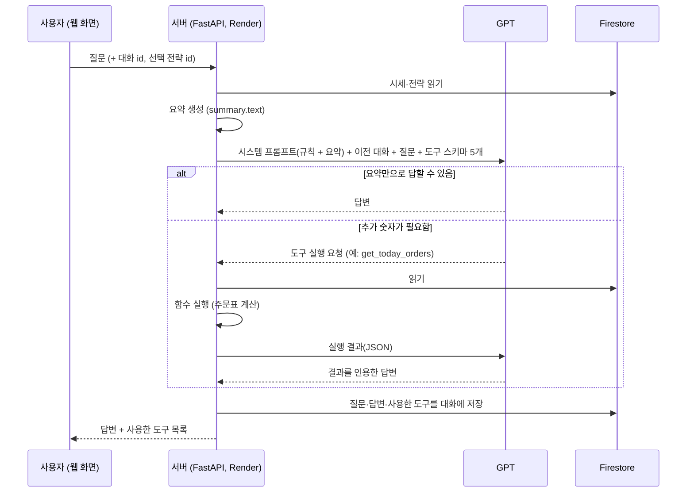
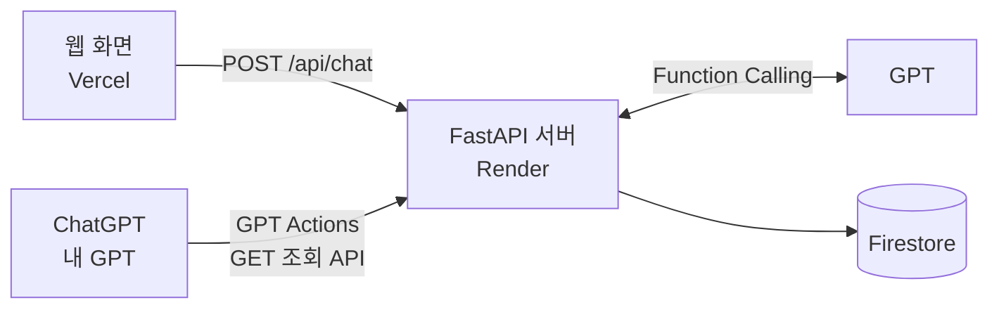
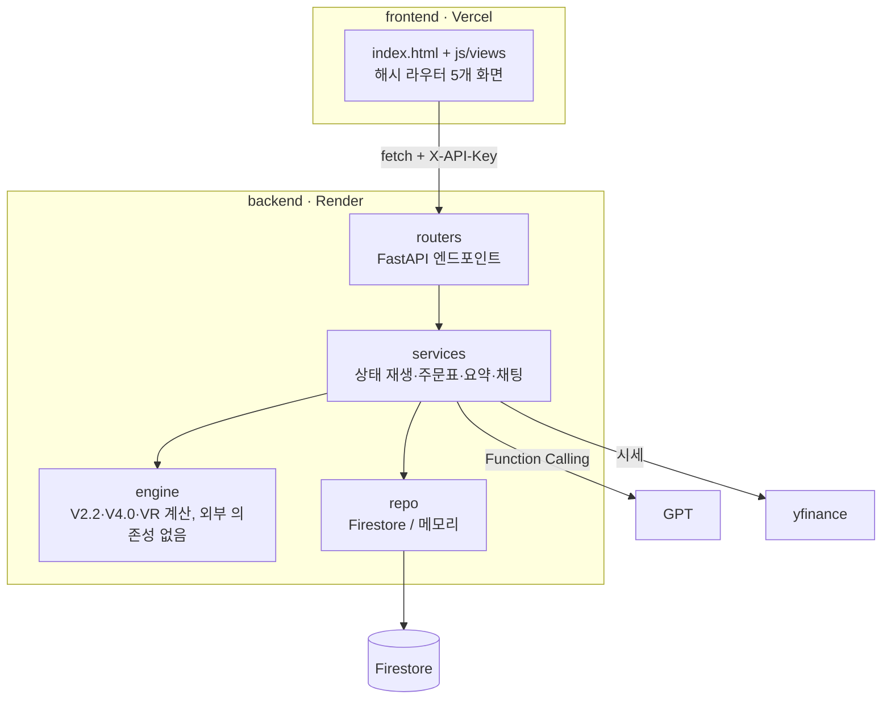

# Rule_Keeper · 분할매수 기록장

라오어 무한매수법(V2.2, V4.0)과 VR 5.0을 여러 전략으로 동시에 운용할 때 쓰는 개인 비서입니다.
매일 저녁 전략마다 주문표를 계산하고, 다음 날 체결을 기록하며, AI에게 현재 상태와 규칙의 근거를 물어볼 수 있습니다.
감정이 아니라 규칙대로 매매하도록 돕는 것이 목표입니다.

> 투자 권유가 아닌 규칙 계산 보조 도구입니다. 무한매수법·VR 방법론의 원저작자는 라오어입니다.

| 구분 | 주소 |
| --- | --- |
| 웹 화면 (Vercel) | https://rulekeeper-frontend.vercel.app |
| API 서버 (Render) | https://rule-keeper.onrender.com · Swagger 문서 `/docs` |
| GPT Actions 스키마 | https://rule-keeper.onrender.com/api/actions/openapi.json |

Render 무료 요금제라 15분 동안 접속이 없으면 서버가 잠듭니다. 첫 접속은 30~60초 걸릴 수 있으며, 화면에 "서버를 깨우는 중" 안내가 나옵니다.


---

## 1. 무엇을 하나요

| 화면 | 내용 |
| --- | --- |
| **오늘 주문** | 전략별 다음 거래일 주문을 전표 형태로 보여 줍니다(매수 빨강, 매도 파랑). 전날 주문은 그날 종가·고가로 자동 판정하고, 확인 후 **체결 확정**으로 기록합니다. |
| **전략** | 무한매수법·VR 전략을 종목·계좌별로 여러 개 등록합니다(실전/시뮬레이션). 상세 화면에서 상태, 그래프, 사이클·V 갱신 이력, VR V 갱신을 다룹니다. |
| **체결 기록** | 체결 기록(data) 조회·추가·수정·삭제, 필터, CSV/JSON 내려받기 |
| **요약·통계** | 종목별 시세 그래프와 통계(기간, 개수, 평균, 최대, 최소, 추세, 변동성, 최대 낙폭), AI에게 들어가는 요약 원문 |
| **AI 비서** | 대화 기록 · 채팅 · AI가 보는 요약 3단 구성. 전략을 골라 질문하면 그 전략 기준으로 답하고, 사용한 도구를 답 아래에 표시합니다. |

| 전략 상세 | 요약·통계 |
| --- | --- |
|  |  |

| 다크 모드 | 체결 기록과 내보내기 |
| --- | --- |
|  |  |

### 지원 규칙

- **무한매수법 V4.0:** 20/40분할, 별% = TQQQ 15−30T/n, SOXL 20−40T/n, 1/4 별지점 LOC + 3/4 지정가 매도, 리버스모드
- **무한매수법 V2.2:** 40분할, 1회 매수금 고정, 쿼터손절
- **VR 5.0:** 적립식·거치식·인출식, 2주마다 V' = V + Pool/G ± 적립·인출금, 밴드 ±15%, Pool 사용 한도 75/50/25%
- 공통: 사다리 LOC, 큰수 매수(증권사 가격 제한 대응), 수량 반올림 규칙, 자동 체결 판정(LOC는 종가, 지정가는 고가 기준)

---

## 2. 과제 요구사항 대응

### 필수

| 요구사항 | 구현 |
| --- | --- |
| 시계열 데이터 100개 이상 | TQQQ·SOXL 일별 시세 각 691개(2024-01-02 ~ 2026-10-02, yfinance) + 시뮬레이션 체결 기록 2,000건 이상 |
| data CRUD | `GET/POST /api/data`, `PUT/DELETE /api/data/{id}`. 과제의 `date·value·memo`에 체결 정보(전략, 매수/매도, 수량, 역할)를 더했습니다. `value` = 체결 단가 |
| 데이터 요약 | `GET /api/data/summary` → 종목별 기간·개수·평균·최대·최소·최근 30거래일 추세 + 전략별 한 줄 상태. `text` 필드가 시스템 프롬프트에 그대로 들어갑니다. |
| 대화 저장·목록·불러오기·삭제 | `POST/GET /api/conversations`, `GET/DELETE /api/conversations/{id}`. 목록은 messages 없이 개수만, 불러오기는 전체 messages |
| AI 채팅 | `POST /api/chat`: 요약을 시스템 프롬프트에 주입 → GPT 호출(도구 사용) → 대화 자동 저장 |
| 저장소 | Firebase Firestore |
| 프론트엔드 | 바닐라 HTML/CSS/JS (빌드 도구 없음) |
| 배포 | 백엔드 Render, 프론트엔드 Vercel |

### 보너스 1: AI 도구 호출(Function Calling) + 멀티채널 연동

- **Function Calling:** 조회 전용 도구 5개를 스키마로 정의해 `/api/chat`에 연결했습니다. → [3. AI 호출 흐름](#3-ai-호출-흐름)
- **멀티채널 (GPT Actions):** 같은 기능을 조회 API로 공개하고, ChatGPT의 내 GPT에 Actions로 연결합니다. → [4. GPT Actions 연동](#4-gpt-actions-연동)

### 보너스 2: 인사이트·UX 고도화

| 요구사항 | 구현 | 위치 |
| --- | --- | --- |
| 추가 지표 1개 이상 | `GET /api/data/statistics`: **연 변동성**(일별 수익률 표준편차 × √252), **최대 낙폭**(고점 대비 최대 하락률), 전략별 실현 수익·평가손익 | 요약·통계 화면 |
| 그래프 | 종가 + 20일 이동평균(종목·기간 선택), 무한매수 전략의 종가 + 평단·별지점선 + 체결 점, VR 전략의 평가금 + V + 밴드. 외부 라이브러리 없이 SVG로 그렸습니다. | 요약·통계, 전략 상세 |
| 내보내기 | `GET /api/data/export?format=csv\|json`. 화면의 필터(전략·기간)가 그대로 적용되고, CSV는 엑셀 한글 깨짐 방지(BOM)를 넣었습니다. | 체결 기록 화면 |
| 다크 모드 | 테마 버튼으로 전환, 브라우저에 기억, 처음에는 OS 설정을 따름 | 왼쪽 아래 |
| 선택 UI | 종목·기간 선택, 체결 기록 필터, AI 비서의 대상 전략 선택 | 각 화면 |

---

## 3. AI 호출 흐름

### 원칙: 숫자는 서버가, 설명은 GPT가

GPT는 Firestore에 직접 접근할 수 없고, T·평단·별지점 같은 숫자를 스스로 계산하면 틀릴 수 있습니다. 그래서

1. 서버가 Firestore를 읽고 계산하는 **함수**를 만들어 두고,
2. GPT에게는 그 함수들의 **이름과 설명(스키마)**만 알려 주며,
3. GPT가 필요하다고 판단하면 "이 함수를 이 값으로 실행해 줘"라고 **요청**하고, 실제 실행은 서버가 합니다.
4. 시스템 프롬프트로 "숫자는 요약이나 도구 결과에 있는 값만 인용하고 직접 계산하지 말 것"을 지시합니다.

### 도구 5개 (모두 조회 전용)

| 도구 | 돌려주는 것 | GPT가 호출하는 근거 (스키마 설명 기준) |
| --- | --- | --- |
| `get_portfolio_summary` | 모든 전략의 한 줄 상태 + 종목별 시세 요약 | 전체 현황, 여러 전략 비교 질문 |
| `get_strategy_status` | 전략 하나의 T, 평단, 별%, 별지점, 잔금, 모드 / VR의 V, 밴드, Pool | 특정 전략의 상세 숫자가 요약에 없을 때 (요약의 `id=` 값을 인자로 사용) |
| `get_today_orders` | 다음 거래일 주문표 (전략 지정 또는 전체) | "오늘 뭐 걸어?"처럼 주문을 묻는 질문. 주문표는 기본 요약에 없으므로 대부분 호출 |
| `get_fill_history` | 체결 기록 (기간·전략 필터, 최신순) | 과거 매매 내역을 묻는 질문 |
| `get_price_stats` | 최근 N거래일 평균·최대·최소·추세·변동성·최대 낙폭 | 요약의 30일 범위를 벗어난 기간을 묻는 질문 |

### 처리 순서 (`POST /api/chat`)



- 도구 호출은 한 질문에 최대 3회까지 허용하고, 마지막에는 도구 없이 답하도록 강제합니다.
- 사용한 도구는 대화 기록의 `tools_used`에 저장되고, 화면에서는 답 아래 회색 표시로 보입니다.

### 실제 예시

| 질문 | 기본 요약에 있는가 | GPT의 판단 | 사용한 도구 |
| --- | --- | --- | --- |
| 최근 30일 TQQQ 추세 어때? | 있음 (30거래일 추세) | 요약 값을 인용해 바로 답함 | 없음 |
| 오늘 뭐 걸어야 해? | 없음 (주문표) | 주문표 도구가 필요하다고 판단 | `get_today_orders` |
| 지금 소진에 가까운 전략 있어? | 일부 (T·잔금 한 줄) | 전체 현황 → 전략별 상세 확인 | `get_portfolio_summary`, `get_strategy_status` × 2 |

아래는 "오늘 뭐 걸어야 해?"에 대한 답입니다. 답 아래의 **[주문표 조회]**가 `get_today_orders`를 호출한 기록이며, 오른쪽 "AI가 보는 요약"에는 주문표가 없다는 것을 확인할 수 있습니다.


---

## 4. GPT Actions 연동

웹 화면 외에 ChatGPT(내 GPT)에서도 같은 데이터를 조회할 수 있게 연결합니다.



- **스키마:** `GET /api/actions/openapi.json`이 OpenAPI 3.1 스키마를 만들어 줍니다. 데이터를 바꾸는 API는 빼고 **조회 API 7개**만 담았습니다.

  | operationId | API |
  | --- | --- |
  | `getSummary` | `GET /api/data/summary` |
  | `listStrategies` | `GET /api/strategies` |
  | `getStrategyStatus` | `GET /api/strategies/{strategy_id}/status` |
  | `getTodayOrders` | `GET /api/orders/today` |
  | `listFills` | `GET /api/data` |
  | `getStatistics` | `GET /api/data/statistics` |
  | `listConversations` | `GET /api/conversations` |

- **인증:** API Key 방식, 헤더 이름 `X-API-Key`
- **서버 주소:** 환경 변수 `PUBLIC_API_URL`(= Render 주소)이 스키마의 `servers`에 들어갑니다.
- **검증 결과:** _연동 후 질문 예시, 호출된 API, 웹 화면과 숫자 비교 결과를 추가합니다._

---

## 5. 구조



### 설계 원칙

- **사실은 저장하고 상태는 계산한다.** 설정, 체결, 주문표, VR 스냅샷만 저장하고 T·평단·별지점은 매번 체결 기록을 처음부터 재생해 구합니다. 체결 하나를 고치면 그 뒤 상태가 저절로 다시 계산됩니다.
- **숫자는 백엔드가, 설명은 GPT가.** GPT에는 계산된 요약과 읽기 전용 도구만 줍니다.
- **Firestore 무료 한도 지키기.** 조회 결과를 서버 메모리에 캐시하고, 이 서버를 거치는 쓰기가 생기면 해당 컬렉션 캐시를 비웁니다.

### Firestore 컬렉션

| 컬렉션 | 내용 |
| --- | --- |
| `strategies` | 전략 설정 (종류, 종목, 버전, 원금·분할 / V·Pool·G, 계좌 메모, 시뮬레이션 여부) |
| `data` | 체결 기록 (date, value, memo + strategy_id, side, qty, role, order_type, source) |
| `order_sheets` | 날짜별 주문표 스냅샷과 확정 여부 |
| `vr_snapshots` | VR 2주 갱신 기록 (V, 평가금, Pool, 밴드) |
| `prices` | 종목별 일별 시세 (시계열 데이터) |
| `conversations` | AI 대화 (title, strategy_id, messages[role, content, tools_used]) |

### 폴더

```
backend/
  app/
    engine/      계산 엔진: infinite.py(V2.2·V4.0), vr.py, common.py, backtest.py
    services/    상태 재생, 주문표, 체결 확정, 요약·통계, 채팅, 대화
    routers/     FastAPI 엔드포인트
    repo/        저장소 (firestore.py, memory.py)
    schemas.py   요청 검증
    main.py      앱 진입점, GPT Actions 스키마
  scripts/seed.py  시세·데모 데이터 적재
  tests/         엔진 30개 + 서비스 17개 테스트
frontend/
  index.html     화면 뼈대
  config.js      백엔드 주소 (로컬이면 127.0.0.1:8000, 배포면 Render)
  css/style.css  라이트/다크 테마
  js/            api.js, chart.js(SVG 그래프), slip.js(주문 전표), views/(화면별 코드)
docs/images/     README 화면 캡처
render.yaml      Render 배포 설정
```

---

## 6. 주요 API

| 메서드 · 경로 | 설명 | 키 필요 |
| --- | --- | --- |
| `GET /api/data` · `POST /api/data` | 체결 기록 목록 · 추가 | 추가만 |
| `PUT /api/data/{id}` · `DELETE /api/data/{id}` | 체결 기록 수정 · 삭제 | ✅ |
| `GET /api/data/summary` | 데이터 요약 (프롬프트 주입용 `text` 포함) | |
| `GET /api/data/statistics` | 추가 지표 (변동성, 최대 낙폭, 전략 성과) | |
| `GET /api/data/export?format=csv\|json` | 체결 기록 내보내기 | |
| `POST /api/conversations` · `GET /api/conversations` | 대화 저장 · 목록 | 저장만 |
| `GET /api/conversations/{id}` · `DELETE /api/conversations/{id}` | 대화 불러오기 · 삭제 | 삭제만 |
| `POST /api/chat` | AI 채팅 (요약 주입 → GPT·도구 → 자동 저장) | ✅ |
| `GET/POST /api/strategies`, `PUT/DELETE /api/strategies/{id}` | 전략 목록·등록·수정·종료 | 변경만 |
| `GET /api/strategies/{id}/status` | 전략 현재 상태 | |
| `GET /api/orders/today` | 전체 전략의 체결 확인 대기 + 다음 거래일 주문표 | |
| `POST /api/strategies/{id}/orders/{date}/confirm` | 자동 판정 결과(수정 포함)를 체결 기록으로 확정 | ✅ |
| `POST /api/strategies/{id}/vr/rebalance` | VR V 갱신 (`dry_run`이면 미리보기) | ✅ |
| `POST /api/strategies/{id}/backtest` | 시뮬레이션 전략 백테스트 | ✅ |
| `POST /api/prices/sync` · `GET /api/prices` | 빠진 날짜 시세 채우기 · 시세 조회 | 채우기만 |
| `GET /api/actions/openapi.json` | GPT Actions용 스키마 | |

데이터를 바꾸는 요청은 `X-API-Key` 헤더가 필요합니다. 전체 목록은 `/docs`(Swagger UI)에서 볼 수 있습니다.

---

## 7. 실행과 배포

### 로컬 실행

```bash
cd backend
python -m venv .venv
.venv\Scripts\activate          # macOS/Linux: source .venv/bin/activate
pip install -r requirements.txt
copy .env.example .env          # macOS/Linux: cp .env.example .env  → 값 채우기

python -m scripts.seed --demo   # 시세 + 시뮬레이션 전략 2개 (한 번만 실행)
uvicorn app.main:app --reload   # http://127.0.0.1:8000/docs
```

화면은 다른 터미널에서 띄웁니다.

```bash
cd frontend
python -m http.server 5500      # http://127.0.0.1:5500
```

데이터를 바꾸는 요청(체결 확정, 전략 등록, 채팅)은 화면 왼쪽 아래 **연결 설정**에 `APP_API_KEY` 값을 넣어야 합니다. 키는 그 브라우저에만 저장되고 코드에는 들어가지 않습니다.

Firebase 없이 확인하려면 `.env`에서 `STORAGE=memory`로 두면 됩니다. 서버를 켤 때 데모 데이터가 자동으로 채워지고, 끄면 사라집니다.

### 환경 변수

| 이름 | 용도 |
| --- | --- |
| `OPENAI_API_KEY` | GPT 호출 키 (교육장 가상 키). `.env`와 Render 환경 변수에만 저장 |
| `OPENAI_BASE_URL` | OpenAI 호환 주소 (교육장: `https://copa.codyssey.kr/v1`) |
| `OPENAI_MODEL` | 모델 이름 (기본 `gpt-5-mini`) |
| `FIREBASE_CREDENTIALS_PATH` 또는 `FIREBASE_CREDENTIALS` | 서비스 계정 키 파일 경로, 또는 키 JSON 문자열/base64 |
| `STORAGE` | `firestore` 또는 `memory` |
| `APP_API_KEY` | 데이터를 바꾸는 요청에 필요한 `X-API-Key` 값 (직접 정한 비밀번호) |
| `ALLOWED_ORIGINS` | CORS 허용 주소 (쉼표 구분, 끝에 `/` 없이) |
| `PUBLIC_API_URL` | GPT Actions 스키마에 들어갈 서버 주소 |

### 배포

- **Render (백엔드):** Web Service, Root Directory `backend`, Build `pip install -r requirements.txt`, Start `uvicorn app.main:app --host 0.0.0.0 --port $PORT`, `PYTHON_VERSION=3.11.9`. Firebase 키 파일은 Secret File(`/etc/secrets/serviceAccountKey.json`)로 넣고 `FIREBASE_CREDENTIALS_PATH`로 가리킵니다.
- **Vercel (프론트엔드):** Root Directory `frontend`, Framework Preset `Other`, 빌드 없음
- **보안:** `.env`와 서비스 계정 키는 `.gitignore`로 저장소에서 제외했습니다. API 키는 코드·README·캡처에 넣지 않습니다.

### 테스트

```bash
cd backend
python -m unittest discover -s tests -t .
```

엔진 테스트는 라오어 카페 원문의 예시 표(T, 별%, 주문 가격·수량)를 그대로 재현하는지 확인합니다.
