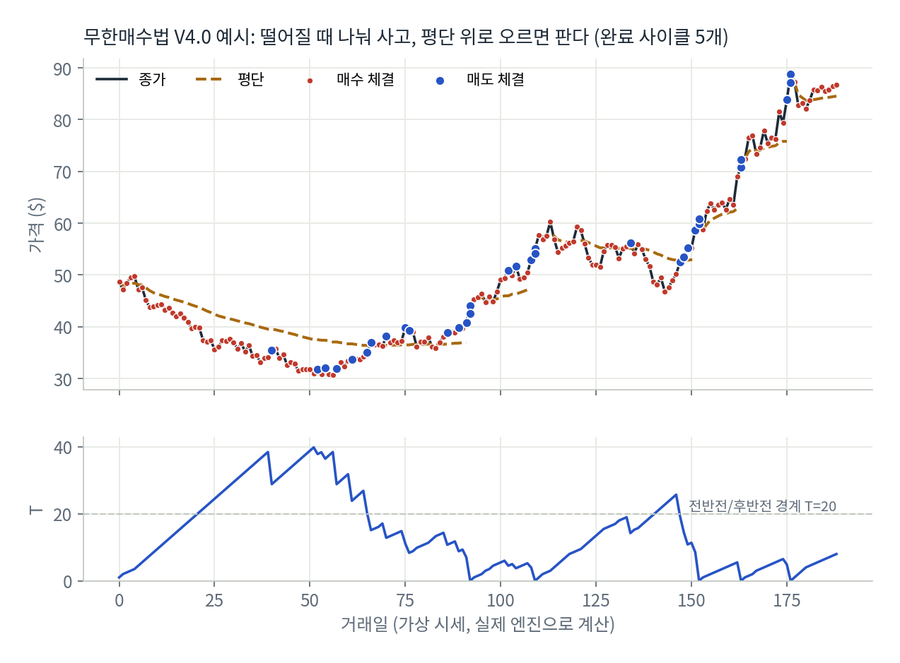
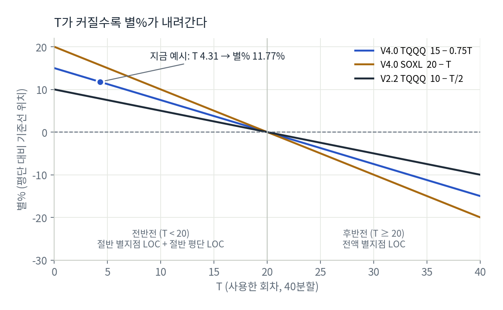
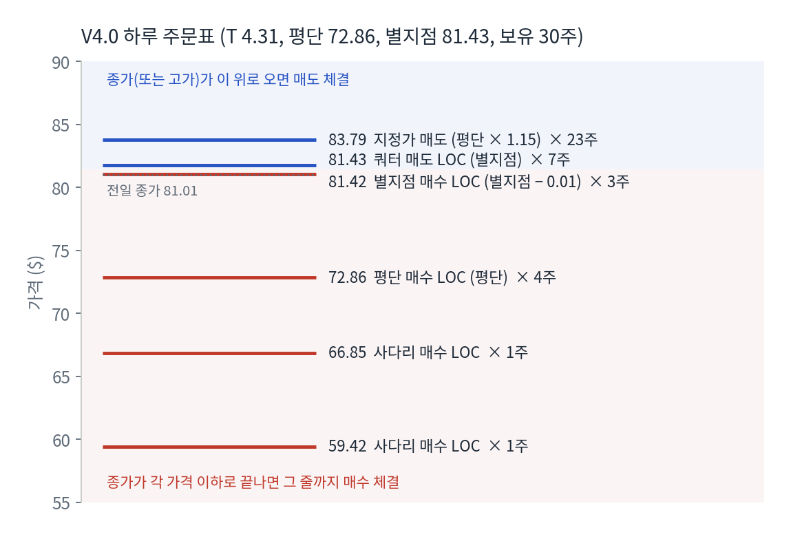
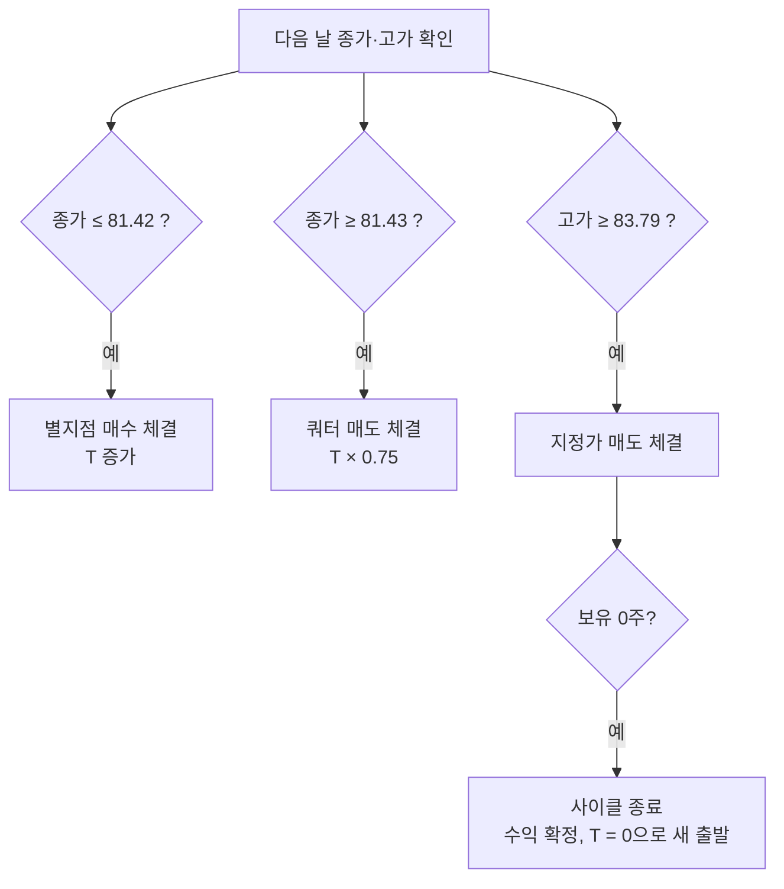
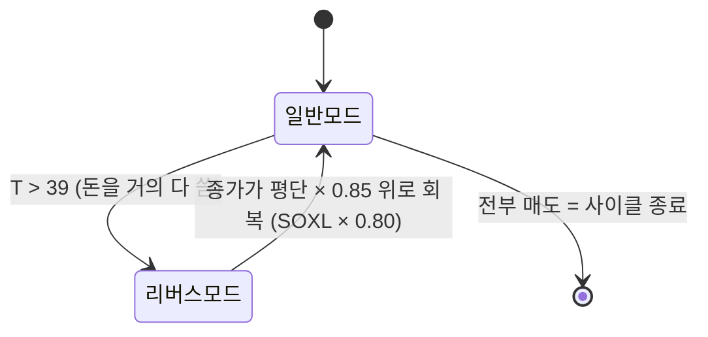
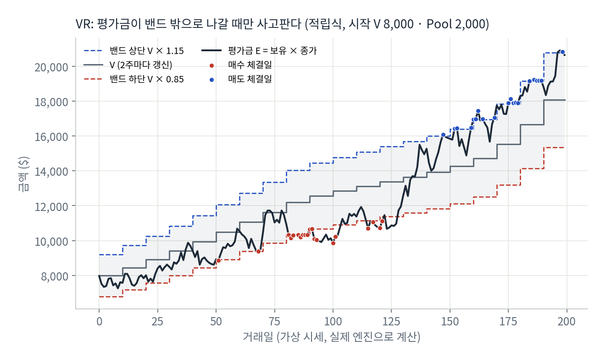
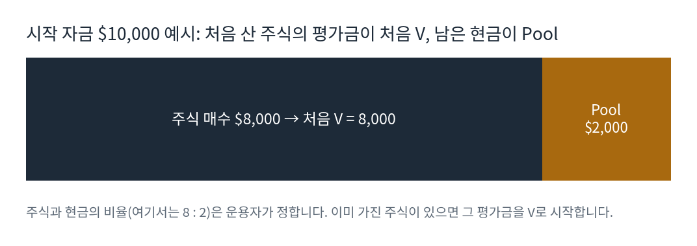
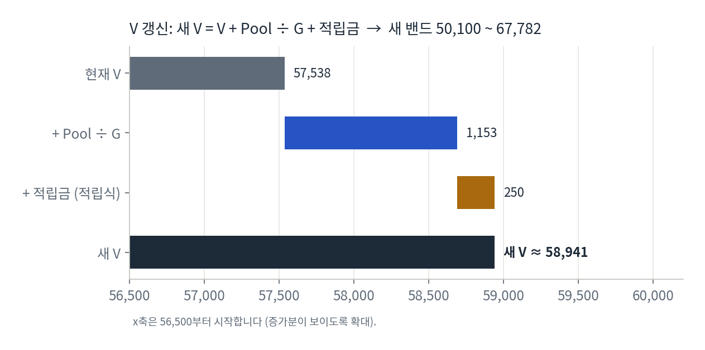
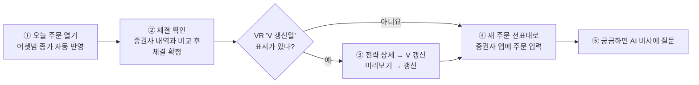

# 무한매수법과 VR, 쉽게 정리하기

Rule_Keeper가 계산하는 두 매매 방법을 실제 앱 화면의 숫자로 따라가며 정리한 문서입니다.
둘 다 라오어가 만든 방법이고, 주로 **TQQQ**(나스닥100 3배)와 **SOXL**(반도체 3배) 같은 3배 레버리지 ETF에 씁니다.

> 투자 권유가 아닌 규칙 설명입니다. 방법론의 원저작자는 라오어이며, 정확한 규칙은 원문을 기준으로 합니다.
> 그림 중 가상 시세를 쓴 것(그림 3, 4)도 계산은 이 앱의 실제 엔진(`backend/app/engine`)으로 했습니다.

**목차**
- [1부. 무한매수법](#1부-무한매수법)
- [2부. VR (밸류 리밸런싱) 5.0](#2부-vr-밸류-리밸런싱-50)
- [3부. 한눈에 비교](#3부-한눈에-비교)
- [4부. 앱에서 매일 하는 일](#4부-앱에서-매일-하는-일)

---

## 1부. 무한매수법

### 한 줄 요약

> **돈을 40등분해서 매일 조금씩 사 모으고, 평단보다 조금 오르면 팔아서 수익을 낸다. 다 팔리면 처음부터 다시(새 사이클).**

3배 ETF는 많이 출렁입니다. 떨어질 때 나눠서 사면 평단이 내려가고, 조금만 반등해도 평단 위로 올라가 수익이 나는 구조를 노립니다.



위 그림은 가상 시세를 V4.0 규칙으로 돌린 결과입니다.
- **위 칸:** 떨어지는 동안 거의 매일 사서(빨간 점) 평단(주황 점선)이 같이 내려갑니다. 가격이 평단 위로 올라오면 팔리고(파란 점), 다 팔리면 평단 선이 끊기며 사이클이 끝납니다.
- **아래 칸:** T(사용한 회차)가 매수할 때마다 올라가고, 매도하면 내려갑니다. 50일 무렵 T가 40 가까이 가는 구간은 돈을 거의 다 쓴 상태이며, 이때 리버스모드(아래 설명)가 작동합니다.

### 기본 용어

| 용어 | 뜻 | 예 (원금 $20,000, 40분할) |
| --- | --- | --- |
| **분할 수 (n)** | 원금을 몇 번에 나눠 살지 | 40 (또는 20) |
| **1회 매수금** | 하루에 쓰는 돈 | V4.0: 잔금 ÷ (40 − T) → 처음엔 $500 |
| **T** | 지금까지 몇 회분을 썼는지 | 1회분을 다 사면 +1, 절반만 사면 +0.5 |
| **평단** | 산 주식의 평균 단가 | |
| **별%** | 오늘 기준선을 평단보다 몇 % 위에 둘지 | T가 커질수록 작아짐 |
| **별지점** | 오늘의 기준 가격 = 평단 × (1 + 별%) | 이 가격을 중심으로 사고팖 |
| **사이클** | 처음 매수부터 전부 팔릴 때까지 | 끝나면 T = 0으로 새 출발 |

### 주문 방식: LOC와 지정가

| 방식 | 뜻 |
| --- | --- |
| **LOC 매수** | 장 마감 **종가**로 사되, 종가가 내가 정한 가격 **이하**일 때만 |
| **LOC 매도** | 장 마감 **종가**로 팔되, 종가가 내가 정한 가격 **이상**일 때만 |
| **지정가 매도** | 장중에 그 가격에 닿으면 팔기 (그날 **고가**가 가격 이상이면 체결) |
| **MOC** | 가격 조건 없이 종가로 무조건 체결 (리버스모드 첫날, 쿼터손절에서 사용) |

그래서 앱은 다음 날 **종가와 고가**만 보고 자동으로 체결 여부를 판정할 수 있습니다.

### 별%: T가 커질수록 기준선이 내려간다



| T | 0 | 10 | 20 | 30 |
| --- | --- | --- | --- | --- |
| V4.0 TQQQ 별% (15 − 0.75T) | 15% | 7.5% | 0% | −7.5% |

- **초반(T가 작을 때):** 기준선을 평단보다 꽤 높게 잡아 적극적으로 삽니다.
- **후반(T가 클 때):** 기준선이 평단 아래로 내려가 신중하게 삽니다.
- T = 20을 기준으로 **전반전**과 **후반전**의 매수 방식이 바뀝니다.

### V4.0 하루 주문 만들기: 실제 화면 숫자로

`[시뮬] TQQQ V4.0 40분할`의 상태를 그대로 따라가 봅니다.

| 순서 | 계산 | 결과 |
| --- | --- | --- |
| ① 현재 상태 | | T **4.31**/40, 평단 **72.86**, 보유 **30주**, 잔금 $19,088 |
| ② 1회 매수금 | 잔금 ÷ (40 − T) = 19,088 ÷ 35.69 | **$534.86** |
| ③ 별% | 15 − 0.75 × 4.31 | **11.77%** |
| ④ 별지점 | 72.86 × 1.1177 | **81.43** |

**⑤ 매수 주문** (T < 20이면 전반전: 1회 매수금을 반씩 나눔)

| 주문 | 가격 | 수량 |
| --- | --- | --- |
| 별지점 매수 LOC | 81.43 − 0.01 = **81.42** | 267 ÷ 81.42 → **3주** (내림) |
| 평단 매수 LOC | **72.86** | 남은 금액 ÷ 72.86 → **4주** (반올림) |
| 사다리 매수 LOC | 더 아래 가격들 | 1주씩 (급락한 날 더 사기) |

후반전(T ≥ 20)이 되면 반으로 나누지 않고 전액을 별지점 LOC로 겁니다.

**⑥ 매도 주문** (보유 30주를 1/4 + 3/4로 나눔)

| 주문 | 가격 | 수량 |
| --- | --- | --- |
| 쿼터 매도 LOC | 별지점 **81.43** | 30 ÷ 4 → **7주** |
| 지정가 매도 | 평단 × 1.15 = **83.79** (TQQQ +15%, SOXL +20%) | 나머지 **23주** |



**⑦ 다음 날 결과에 따라**



이것이 앱 "오늘 주문" 화면의 빨간 매수 줄, 파란 매도 줄의 정체입니다.

### 돈이 바닥날 때: 리버스모드 (V4.0)



- 첫날 보유량의 1/20(20분할은 1/10)을 **MOC** 매도
- 이후 기준선(별지점)은 **직전 5거래일 종가 평균**
- 기준선 위에서는 조금씩 팔고, 아래에서는 남은 현금의 1/4로 삼
- 종가가 평단 대비 −15%(SOXL −20%)보다 위로 올라오면 일반모드로 돌아옴 (T는 이어서 사용)

### V2.2는 무엇이 다른가

| | V4.0 | V2.2 |
| --- | --- | --- |
| 1회 매수금 | 잔금 ÷ (n − T), 매일 바뀜 | 원금 ÷ 40, **고정** |
| T | 체결할 때마다 +1, +0.5, ×0.75 | 누적 매수액 ÷ 1회 매수금 |
| 별% (TQQQ) | 15 − 0.75T | 10 − T/2 |
| 목표 수익 | +15% (SOXL +20%) | +10% (SOXL +12%) |
| 돈이 바닥나면 | 리버스모드 | **쿼터손절**: 1/4을 MOC로 팔고, 10회에 걸쳐 −10%(SOXL −12%) 아래에서 매수 |

---

## 2부. VR (밸류 리밸런싱) 5.0

### 한 줄 요약

> **"지금쯤 내 주식 평가금은 이 정도면 된다"는 목표선 V를 정하고, 평가금이 V보다 너무 낮으면 사고, 너무 높으면 판다. V는 2주마다 조금씩 올린다.**

무한매수법은 **평단** 기준으로 매매하지만, VR은 평단을 쓰지 않고 **평가금(E)과 목표선(V)의 차이**만 봅니다.



위 그림은 가상 시세를 VR 적립식 규칙으로 돌린 결과입니다.
- **회색 계단(V)** 이 2주마다 한 칸씩 올라가고, 위아래 점선이 밴드(±15%)입니다.
- **검은 선(평가금)** 이 밴드 안에 있는 동안은 아무 거래도 없습니다.
- 80~120일 구간처럼 평가금이 **하단 밖으로** 떨어지면 사고(빨간 점), 150일 이후처럼 **상단 밖으로** 오르면 팝니다(파란 점).

### 기본 용어

| 용어 | 뜻 | 실제 화면 값 |
| --- | --- | --- |
| **E (평가금)** | 보유 수량 × 현재가 | 702주 × 81.01 ≈ **56,869** |
| **V (목표 평가금)** | 지금 이 정도면 적당하다는 기준선 | **57,538** |
| **밴드** | V의 ±15% 구간. 이 안이면 아무것도 안 함 | **48,907 ~ 66,169** |
| **Pool** | 매수용 현금 | **11,529** |
| **G** | V를 얼마나 빨리 올릴지 정하는 값 (클수록 천천히) | 10 |
| **적립·인출금** | 2주마다 넣는 돈(적립식) 또는 빼는 돈(인출식) | 250 (적립식) |

### 처음 V는 어떻게 정하나



- **처음 V = 시작할 때 산 주식의 평가금**(수량 × 매수가)입니다. 산 직후에는 평가금 E와 V가 같아서 밴드 한가운데에서 출발합니다.
- **처음 Pool = 주식을 사고 남겨 둔 현금**입니다.
- **주식과 현금의 비율은 운용자가 정합니다.** Pool을 많이 남기면 하락장에서 오래 버틸 수 있지만, 상승장에서는 주식이 적어 수익이 덜 납니다. 원문에서 권하는 비율이 있다면 그 기준을 따르세요.
- **이미 주식을 가지고 있다면** 지금 보유 수량 × 현재가를 처음 V로 잡고, 매매용으로 따로 둘 현금을 Pool로 잡으면 됩니다.

**앱에서는** 전략 등록 때 이렇게 입력합니다.

| 입력 칸 | 넣을 값 |
| --- | --- |
| 시작 V | 처음 산(또는 가진) 주식의 평가금 |
| 시작 Pool | 남겨 둔 현금 |
| 이미 가진 수량 | 이미 보유한 주식 수 (새로 시작하면 0) |
| 2주 적립·인출금 | 적립식이면 넣을 돈, 인출식이면 뺄 돈 |

시뮬레이션 전략(`[시뮬] TQQQ VR 적립식`)은 시작 V 8,000, Pool 2,000으로 등록했고, 시작 직전 거래일 종가로 8,000달러어치(1주 미만은 버림)를 산 것으로 처리했습니다.

### 매일 하는 일: 밴드 밖에서만 매매

```
          66,169 ── 밴드 상단 ── 평가금이 위로 넘으면 매도 (판 돈은 Pool로)
            ↑
  E 56,869  ●     ← 지금은 밴드 안 → 아무 일도 안 함
            ↓
          48,907 ── 밴드 하단 ── 평가금이 아래로 내려가면 매수 (Pool 현금 사용)
```

주문 가격은 **"그 가격이 되면 평가금이 밴드 끝에 닿는 가격"** 입니다. 1주씩 계단처럼 겁니다.

| 주문 | 계산 | 실제 화면 |
| --- | --- | --- |
| 1번째 매수 LOC | 하단 ÷ (보유 + 1) = 48,907 ÷ 703 | **69.56** × 1주 |
| 2번째 매수 LOC | 48,907 ÷ 704 | **69.47** × 1주 |
| 1번째 매도 LOC | 상단 ÷ (보유 − 1) = 66,169 ÷ 701 | **94.40** × 1주 |

TQQQ가 81 근처라 69 밑으로 떨어지거나 94 위로 올라가야 체결됩니다. 그래서 화면에 "평가금이 밴드 안에 있습니다"가 표시됩니다.

### 2주마다 하는 일: V 갱신

```
새 V = V + Pool ÷ G + 적립금      (인출식은 + 적립금 대신 − 인출금)
```



- 57,538 + 11,529 ÷ 10 + 250 ≈ **58,941**
- 새 밴드: 58,941 × 0.85 ≈ **50,100** ~ 58,941 × 1.15 ≈ **67,782**

V가 오르면 밴드 하단도 올라가서, 같은 가격에서도 더 사게 됩니다. 시간이 갈수록 보유량을 조금씩 늘려 가는 구조입니다.

**Pool 사용 한도:** 한 번에 현금을 다 쓰지 않도록, 2주 동안 쓸 수 있는 Pool을 제한합니다. 앱 화면의 "이번 사이클 남은 매수 한도"가 이 값입니다.

| 유형 | 2주마다 | Pool 사용 한도 |
| --- | --- | --- |
| **적립식** | 적립금을 넣음 (V에 + 적립금) | 75% |
| **거치식** | 넣지도 빼지도 않음 | 50% |
| **인출식** | 생활비 등을 뺌 (V에 − 인출금) | 25% |

---

## 3부. 한눈에 비교

| | 무한매수법 | VR |
| --- | --- | --- |
| 기준 | **평단** | **목표 평가금 V** |
| 매매 빈도 | 거의 매일 (LOC 매수·매도) | 밴드를 벗어날 때만 |
| 수익 실현 | 지정가에 다 팔리면 사이클 종료 | 밴드 상단을 넘을 때마다 조금씩 매도 |
| 사람이 할 일 | 매일 주문 입력, 체결 확정 | 2주마다 V 갱신, 체결 확정 |
| 위험 상황 | 돈 소진 → 리버스모드(V4.0), 쿼터손절(V2.2) | Pool 소진 → 한도까지만 매수 |
| 앱에서 보는 값 | T, 평단, 별%, 별지점 | V, 평가금, 밴드, Pool |

---

## 4부. 앱에서 매일 하는 일

한국 시간 저녁, 미국장이 열리기 전에 아래 순서로 씁니다.



| 순서 | 화면 | 하는 일 |
| --- | --- | --- |
| ① | 오늘 주문 | 접속하면 어젯밤 미국 종가가 자동으로 들어옵니다 |
| ② | 오늘 주문 → 체결 확인 | 자동 판정을 증권사 체결 내역과 비교하고, 다르면 고친 뒤 **체결 확정** |
| ③ | 전략 상세 → V 갱신 | "V 갱신일" 표시가 뜬 VR 전략만 (2주마다) |
| ④ | 오늘 주문 | 새로 계산된 전표대로 증권사 앱에 주문 |
| ⑤ | AI 비서 | "왜 이 가격이야?", "소진에 가까운 전략 있어?" 같은 질문 |

- 하루를 건너뛰었다면 그날은 주문표가 만들어지지 않으므로, **체결 기록 → 체결 직접 입력**으로 증권사 내역을 옮겨 적습니다.
- 같은 종목을 여러 전략으로 운용하면 평단이 섞이므로 **계좌를 나눠야** 합니다. 같은 종목·같은 계좌로 등록하면 앱이 경고합니다.
